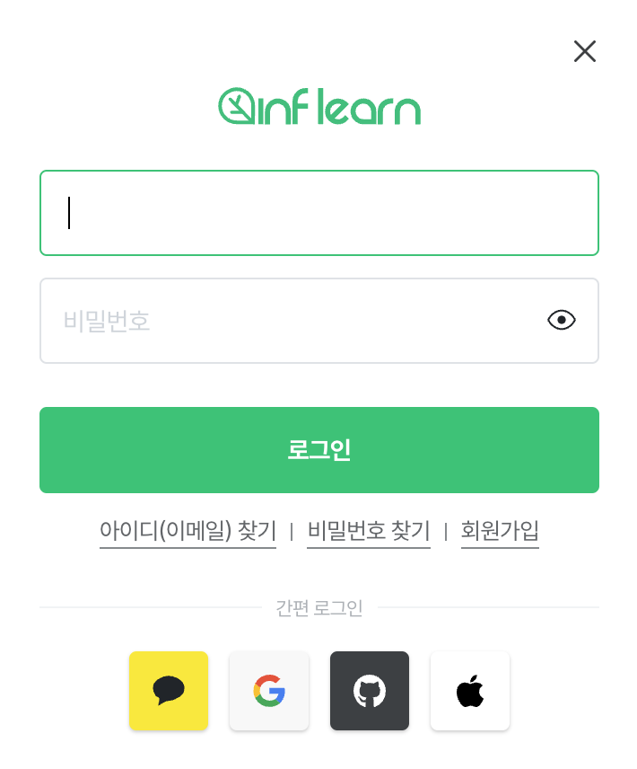

TOC
- [OAuth?](#oauth)
  - [OAuth의 배경](#oauth의-배경)
- [OAuth 1.0](#oauth-10)
  - [작동 방식](#작동-방식)
    - [연결](#연결)
    - [데이터 요청 및 응답](#데이터-요청-및-응답)
    - [문제?](#문제)
- [OAuth 2.0](#oauth-20)
  - [작동 방식](#작동-방식-1)
  - [주요 차이점](#주요-차이점)
- [참고](#참고)

OAuth를 사용한 프로젝트를 수행하기 위해, OAuth가 무엇이고, OAuth1.0과 OAuth2.0은 무엇이 다른지에 대해 알아보고자 작성한 포스트이다.

# OAuth?

위와 같은 로그인창을 본 경험이 있다. 우리는 새로운 아이디나 비밀번호를 만들어 회원가입을 할 수도 있지만, 카카오톡, 구글, 깃허브, 애플 등등 다양한 플랫폼의 계정 정보를 통해 회원가입 및 로그인을 할 수 있다.

이와 같이, **외부 서비스에서도 인증을 가능**(인증, Authentication)하게 하고, **그 서비스의 API를 이용**(권한, Authorization)하게 해주는 것을 **OAuth(Open Authorization)** 라고 한다.

좀 더, 기술적으로 말하자면, 다양한 플랫폼의 특정 사용자 데이터에 접근하기 위해 제 3자(우리가 사용하는 서비스)가 사용자의 접근 권한을 **위임**받을 수 있는 **개방형 표준 프로토콜**이다.

## OAuth의 배경
예전에 서비스들을 사용했을 때는 위와 같은 화면들을 보지 못했던 것 같은데, 어떤 배경으로 이러한 기술이 생겨났을까?

우리가 다음과 같은 기능을 가진 서비스를 개발한다고 가정해보자.
- 사용자를 대신해 깃허브 이슈를 생성하는 기능
- 네이버 메일을 작성해 전송하는 기능

이 기능을 수행하는 방법은 여러 가지가 있지만, 가장 간단한 방법은 사용자로부터 **"깃허브나, 네이버 계정 정보를 받아 서비스에 저장하고 활용"**하는 것이다.
- 하지만 처음 보는 서비스에 자신의 계정 정보를 믿고 맡기는 사용자가 몇이나 될까?
  - 보안 관점에서 매우 믿음직스럽지 못한 서비스일 것이다.
- 또한 우리의 서비스가 공격받아 DB가 탈탈 털려버린다면, 깃허브, 네이버 입장에서도 신뢰할 수 없는 제 3자로 인해 막대한 피해가 발생할 것이다.

이전에는, 플랫폼들은 각자가 개발한 방식을 사용했다. (Google - AuthSub, Yahoo - BBAuth)
- 하지만 이러한 방식은 **표준화되어 있지 않아서**, 각 프로토콜에 의존적인 코드가 발생하게 된다.

=> **이러한 문제를 해결하기 위해 OAuth가 등장했다.**

---

# OAuth 1.0
트위터의 주도로 OAuth 1.0이 등장하게 되었다. 이는 기본적으로 세 개의 구성원이 인증을 처리하는 방식이다.
- 애플리케이션(우리가 개발하는 서비스) - "소비자"
- 서비스 제공자(ex. 다양한 소셜 미디어 플랫폼) - "제공자"
- "사용자"

여기에 더하여, 아래 3가지의 정보가 필요하다.
- 서비스 제공자에게 소비자임을 인증하기 위한 키 - "소비자 비밀번호"
- 소비자가 사용자에게 접근 권한을 인증받기 위해 필요한 정보가 담긴 토큰 - "요청 토큰"
- 인증 후, 사용자가, 서비스 제공자가 아닌 소비자를 통해 자원 접근하는 것을 허락하는 키를 가진 토큰 - "접근 토큰"

## 작동 방식
### 연결
OAuth 1.0은 아래와 같은 방식으로 소비자와 서비스 제공자 간의 연결을 생성한다.

1. **애플리케이션 등록 단계** : 애플리케이션(소비자)은 서비스 제공자로부터 **등록을 수행**하여 고유한 식별자와 비밀 키를 받는다. 
   - 서비스 제공자는 이를 통해 요청 토큰을 생성해 반환한다.
   - 이 토큰은 애플리케이션을 식별하고, 애플리케이션이 서비스 제공자로부터 액세스 권한을 얻을 수 있도록 허용한다.
2. **사용자 인증 단계** : 사용자는 서비스 제공자에 로그인한다. 이후 애플리케이션은 인증을 위해, 사용자를 서비스 제공자의 인증 페이지로 리다이렉션한다.
   - 이때 애플리케이션은 서비스 제공자에게 사용자 데이터에 접근하고자 하는 요청 토큰을 전달한다.
   - 사용자는 로그인한 후, 애플리케이션이 요청하는 권한을 승인할 것인지를 묻는 화면을 보게 되고, 이를 승인하면 서비스 제공자가 사용자에게 인증 코드를 발급한다. (이는 다음 단계에서 사용된다!)
3. **액세스 토큰 및 액세스 토큰 비밀 키 얻기** : 위 단계에서 얻은 인증 코드를 사용해 서비스 제공자에게 액세스 토큰을 요청한다.
   - 이를 위해 요청 토큰, 이전 단계에서 얻은 인증 코드를 전달한다.
   - 서비스 제공자는 이를 확인하고 액세스 토큰과 액세스 토큰 비밀 키를 발급한다.
4. **연결 생성** : 이제 애플리케이션은 이 액세스 토큰 및 비밀 키를 이용해 사용자 데이터에 접근하는데 사용한다.

### 데이터 요청 및 응답
위와 같은 방식으로 연결을 생성했고, 이제 데이터를 얻어올 수 있는 상태가 되었다. 이 과정에 요청 토큰, 액세스 토큰, 비밀 키와 같은 여러 정보들이 생성되었는데, 이를 어떻게 이용하여 데이터를 요청하고 응답받을 수 있을까?

1. 애플리케이션은 액세스 토큰, 액세스 토큰 비밀 키를 포함해 서비스 제공자에게 인증된 요청을 보낸다.
   - 이를 위해, 애플리케이션은 요청에 **서명**을 추가한다.
   - 서명은 애플리케이션의 식별자와 비밀 키, 즉 요청 토큰, 액세스 토큰과 액세스 토큰 비밀 키를 사용해 생성된다.
2. 서비스 제공자는 해당 요청을 검증하고, 올바른 경우에만 처리한다.

### 문제?
하지만 위 방식의 OAuth 1.0은 보안적인 문제가 존재한다.

1. 서명 방식
   - 서명 생성을 위해 비밀 키를 사용하는데, 이는 중간에서 악의적인 공격자가 서명을 복구해 요청을 위조할 가능성이 있다.
2. 사용자 인증 단계
   - 사용자 인증 과정이 2단계로 나뉜다.
     - 사용자가 애플리케이션에 로그인한다.
     - 애플리케이션이 사용자를 서비스 제공자로 리다이렉션하여 액세스 권한을 승인받는다.
   - 이는 사용자 경험에 제약을 줄 수 있다.

그래서 이를 해결한 **OAuth 1.0a**가 등장했다.

> 하지만, 발전된 1.0a 또한, 웹 애플리케이션이 아닌 애플리케이션에서는 사용하기 곤란하다는 단점과, 이런저런 복잡한 절차로 인해 다음 버전의 프로토콜이 생겨나게 된다..

---

# OAuth 2.0
현재 대부분의 애플리케이션 및 서비스에서 사용하는 OAuth 프로토콜이다.

주요 구성 요소는 다음과 같다.
- 액세스를 요청하는 애플리케이션, 사용자의 데이터에 접근하기 위해 인증 및 권한 부여를 수행 - "주체(Subject)"
- 사용자의 데이터를 보유한 서버 - "자원 서버(Resource Server)"
- 애플리케이션(주체)의 인증 및 권한 부여를 담당 - "인증 서버(Authorization Server)"
- 애플리케이션(주체)이 자원 서버에게 요청을 보낼 때 사용되는 자격 증명 - "액세스 토큰"

## 작동 방식

1. **클라이언트 등록** : 클라이언트 애플리케이션을 인증 서버에 등록한다.
   - 클라이언트 식별자, 비밀 키를 발급받는다.
2. **사용자 인증 및 동의** : 사용자는 애플리케이션을 통해 인증 서버로 리다이렉트된다.
   - 사용자는 자신의 인증 정보를 입력하고, 애플리케이션이 요청하는 권한에 동의할 수 있다.
3. **액세스 토큰 발급** : 사용자의 동의를 받은 후, 인증 서버가 애플리케이션에게 액세스 토큰을 발급한다.
4. **자원 액세스** : 액세스 토큰을 사용해 애플리케이션이 자원 서버에 요청을 보내고, 올바른 경우 자원 액세스를 허용한다.

## 주요 차이점
그렇다면 앞선 OAuth 1.0a와는 어떤 점이 다를까?

1. **인증 방식**
   - 주로 액세스 토큰만을 사용해 인증을 수행한다. (OAuth 1.0a의 경우 요청 토큰도 함께 사용)
2. **보안 수준**
   - TLS(Transport Layer Security)를 기반으로 통신 보안을 제공한다. 따라서 HTTPS 사용을 권장한다.
   - 그리고, 이를 통해 서명의 생성이 필요없다.
3. **사용자 인증 과정**
   - 사용자가 액세스 권한을 승인하면, 제공자가 사용자를 애플리케이션으로 리다이렉션하고, 애플리케이션은 액세스 토큰을 발급받는다. 
   - 따라서 사용자 경험이 개선된다.
4. **범위**
   - 액세스 토큰의 만료 기간을 설정할 수 있다.
   - 따라서 Refresh Token을 사용할 수 있어 보안적으로 향상된다.

---

# 참고
- https://kariskan.tistory.com/183
- https://showerbugs.github.io/2017-11-16/OAuth-%EB%9E%80-%EB%AC%B4%EC%97%87%EC%9D%BC%EA%B9%8C
- https://hudi.blog/oauth-2.0/
- https://ddok2.github.io/TIL/architecture/oauth2-overview.html#oauth-2-0