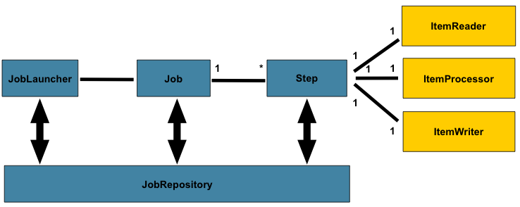

**TOC**
- [배치란 무엇인가?](#배치란-무엇인가)
  - [배치와 스케줄러](#배치와-스케줄러)
  - [Batch 사례](#batch-사례)
    - [일매출 집계](#일매출-집계)
- [배치 용어](#배치-용어)
  - [Job](#job)
    - [JobInstance](#jobinstance)
    - [JobParameters](#jobparameters)
    - [JobExecution](#jobexecution)
    - [참고](#참고)

# 배치란 무엇인가?
: 일괄 처리

매일 일정한 시간에 수행되는, 대량의 데이터를 처리하거나 많은 양의 자원을 필요로 하는 일을 수행하는 것을 말한다.
- 그리고 이를 수행하는 애플리케이션이 배치 애플리케이션이다.

이러한 배치 애플리케이션은 아래의 조건을 만족해야 한다.
- **대용량 데이터**: 대량의 데이터를 가져오거나, 전달하거나, 계산하는 등의 처리를 해야 한다.
- **자동화**: 심각한 문제 해결을 제외하고는 사용자 개입 없이 실행되어야 한다.
- **견고성**: 잘못된 데이터를 충돌/중단 없이 처리해야 한다.
- **신뢰성**: 무엇이 잘못되었는지에 대한 추적이 가능해야 한다.
- **성능**: 지정한 시간 안에 처리를 완료하거나, 동시에 실행되는 다른 애플리케이션을 방해하지 않도록 수행되어야 한다.

스프링에서는 이러한 배치 애플리케이션을 지원하고자, **Spring Batch**를 제공한다.

## 배치와 스케줄러
Spring에는 배치를 지원하는 Spring Batch와, 스케줄링을 지원하는 Spring Quartz가 있고, 이 두 가지를 비교하는 글이 많다.

> 스케줄링은, 일정한 시간 간격으로 반복적인 작업을 수행하는 것을 의미한다.

- Quartz는 스케줄러의 역할을 수행할 뿐, 대용량 데이터에 대한 배치는 지원하지 않는다.
- 또한 Batch 역시 스케줄링 기능은 지원하지 않는다.

> 따라서, 앞서 말한 일정한 시간에 수행되는 대용량 데이터 일괄 처리와 같은 작업은, 사실 **스케줄링**과 **배치**가 합쳐진 것을 말한다고 볼 수 있는 것 같다.
> => '배치 작업'을 '스케줄링'해서 진행한다!

## Batch 사례
### 일매출 집계
전날의 매출 데이터는 거래량에 따라 100만 ~ 200만 개가 될 수도 있다.
- 이를 **실시간**으로 집계하는 것은 조회 시간, 서버 부하에 영향을 줄 수 있다.
- 따라서 **매일 새벽**(정해진 시간 => **스케줄링**), 전날의 매출 집계 데이터를 수집(대용량 데이터 처리 => **배치**)해 생성하고, 외부 요청 시 미리 만든 집계 데이터를 전달하는 방식으로 이를 해결할 수 있다.

# 배치 용어

- `Job` 하나는 1 ~ N개의 `Step`을 가지고,
- 각 `Step`는 딱 1개씩의 `ItemReader`, `ItemProcessor`, `ItemWriter를` 가진다.
- 각 `Job`은 `JobLauncher`가 실행하고, 
- 현재 실행 중인 프로세스의 메타 정보는 `JobRepository`에 저장된다.

## Job
하나의 배치 프로세스를 캡슐화한 엔티티라고 할 수 있다.
- `Job` -> `JobInstance` -> `JobExecution`
- `Step` 인스턴스의 컨테이너 개념
  - 한 플로우에 속한 여러 개의 `Step` 을 결합하고, 재시작과 같은 속성을 전역으로 구성한다.
- **Job 구성 정보**는 다음과 같다.
  - 단순 Job의 name
  - Step 인스턴스 정의와 순서
  - Job의 재시작 가능 여부

### JobInstance

### JobParameters

### JobExecution

### 참고
- https://github.com/jojoldu/spring-batch-in-action/tree/master
- https://godekdls.github.io/Spring%20Batch/domainlanguage