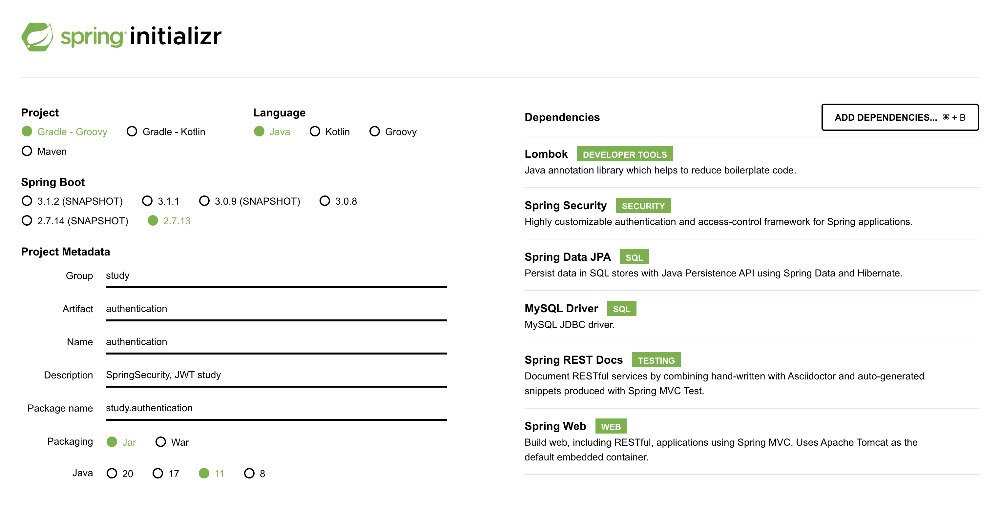
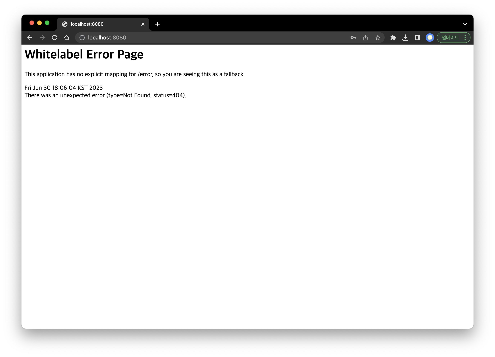
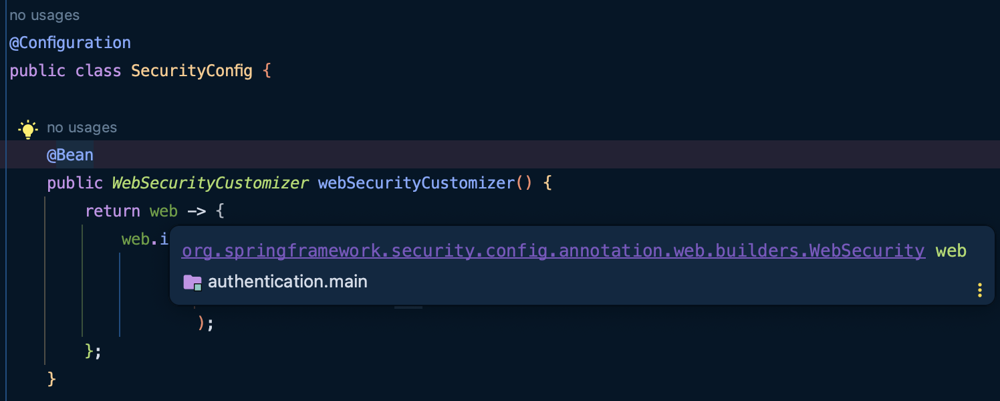

**Spring Security와 JWT를 사용하여 사용자 인증 구현**

TOC
- [시작!](#시작)
  - [학습 배경](#학습-배경)
  - [목표](#목표)
- [프로젝트 설정](#프로젝트-설정)
  - [사용할 스택](#사용할-스택)
  - [데이터 세팅](#데이터-세팅)
- [회원 가입](#회원-가입)
  - [요구 사항 1.](#요구-사항-1)
    - [Spring Security 설정](#spring-security-설정)
  - [요구 사항 2.](#요구-사항-2)
    - [비밀번호 암호화](#비밀번호-암호화)
    - [DB 저장](#db-저장)
- [로그인](#로그인)
- [참고](#참고)

# 시작!
## 학습 배경
SpringBoot를 이용해 여러 REST API를 구현한 경험은 있지만, 사용자 인증에 대한 구현 경험은 전무했다. 따라서 이에 대한 경험을 쌓고, 후에 Spring Security와 JWT를 활용하는데 도움이 되고자 한다.

## 목표
- Spring Security를 통해 비밀번호를 암호화하여 **회원가입**
- DB에 저장된 사용자의 계정과 비밀번호로 **로그인**
- JWT를 사용하여 로그인한 사용자에게 토큰 발급
- 인가된 토큰의 권한에 따라 API 접근 권한 제어
- 로그인된 사용자의 정보를 토대로 동작하는 API 작성
- Swagger UI(혹은 Spring Rest Docs)를 통해 권한에 따른 API 호출 여부 테스트
- 깃허브 OAuth 2.0 적용

---

# 프로젝트 설정
## 사용할 스택
- Java 11
- Spring boot 2.7.13
- Gradle
- MySQL 8.0.33
- [MySQL Workbench 8.0.33](https://dev.mysql.com/downloads/workbench/)



## 데이터 세팅
MySQL에 대한 설치를 마친 후, 사용자 정보를 저장하기 위해 간단한 테이블을 생성한다.

```sql
CREATE TABLE IF NOT EXISTS `auth`.`user` (
  `user_id` VARCHAR(45) NOT NULL,
  `password` VARCHAR(200) NOT NULL,
  `user_name` VARCHAR(45) NOT NULL,
  `join_time` TIMESTAMP,
  `user_type` ENUM('BASIC', 'VIP'),
  PRIMARY KEY (`user_id`))
ENGINE = InnoDB
DEFAULT CHARACTER SET = utf8mb3;
```
- 사용자 id, 비밀번호, 이름을 입력받고,
- 가입일자를 현재 시간으로 저장한다.
- 또한 사용자 권한에 따른 처리를 위해 3가지 등급으로 구분한다.
  - BASIC : 일반 회원
  - VIP : 고급 회원

DB 생성 후, 스프링 부트 애플리케이션을 실행시켜 반가운 화이트라벨을 맞이하자.



---

# 회원 가입
우선, 회원 가입을 구현해야 이후의 처리를 할 수 있다. 따라서 회원 가입을 먼저 구현한다.

**회원 가입의 요구 사항**은 다음과 같다.
1. 사용자는 아이디, 이름, 비밀번호를 입력하고, 서버로 요청을 보낸다. (회원 등급은 BASIC가 기본값)
2. 서버는 사용자의 비밀번호를 암호화하여, DB에 저장한다.

위 시나리오대로, 하나씩 구현해보자.

## 요구 사항 1.
먼저 사용자의 요청을 처리할 컨트롤러와, 사용자 입력 값을 담을 DTO를 생성한다.

```java
@RestController
public class AuthController {
    @PostMapping("/signup")
    public void signUp(@RequestBody SignUpDto signUpDto) {
        // 회원 가입 처리 로직이 있다고 가정
    }
}
```
```java
@Getter
public class SignUpDto {
    String userId;
    String password;
    String userName;
}
```

해당 엔드포인트로 요청을 보내게 되면, **401 상태 코드**를 받게 된다.
- 해당 상태 코드는 요청된 리소스에 대한 유효한 인증 자격 증명이 없기 때문에 클라이언트 요청이 완료되지 않았음을 의미한다!

-> **Spring Security**를 추가하면, 애플리케이션 실행 시 로그인을 진행해야 한다. 따라서 로그인되지 않았기에 해당 상태 코드를 반환받게 되는 것이다.

**=> 회원가입이나, 로그인의 경우는 이러한 로그인이 없이(권한 없이)도 사용할 수 있는 기능이어야 한다. 따라서, Spring Security 설정에서 해당 요청에 대한 예외 처리를 수행하자.**

### Spring Security 설정
Security에 대한 설정을 위해, 이전에는 `WebSecurityConfigurerAdapter` 라는 추상 클래스를 상속받아 사용했다.
- 하지만 스프링 부트 2.7 버전 이상부터는 지원이 중단되어 deprecated됨!
  - 컴포넌트 기반의 security 설정을 위함.
  - 참고: https://spring.io/blog/2022/02/21/spring-security-without-the-websecurityconfigureradapter

위 문서를 통해, Security를 적용하지 않을 리소스에 대한 설정을 아래와 같이 적용할 수 있다. (로그인도 추가했다.)

```java
@Configuration
public class SecurityConfig {

    @Bean
    public WebSecurityCustomizer webSecurityCustomizer() {
        return web -> {
            web.ignoring()
                    .antMatchers(
                            "/signup", "/signin"
                    );
        };
    }

    @Bean
    public SecurityFilterChain filterChain(HttpSecurity http) throws Exception {
        http
                .csrf().disable()
                .authorizeHttpRequests((authz) -> authz
                        .antMatchers("/signup", "/signin").permitAll()
                        .anyRequest().authenticated()
                )
                .httpBasic(withDefaults());
        return http.build();
    }
}
```

여기서 두 메소드에서 등장하는 `WebSecurity` 와 `HttpSecurity` 에 대해서 알아보자.

**WebSecurity vs. HttpSecurity?**

Spring은 SpringBuilder라는 웹 보안을 구성하는 빌더 클래스로서, 웹 보안을 구성하는 빈 객체와 설정 클래스들을 생성한다. 이때, 이 빌더의 종류에 위 두 가지가 해당된다.
- 두 빌더 모두 Spring Security에서 제공하는 인터페이스이다.

> **인증**은 사용자의 신원을 확인하는 과정이고, **인가**는 인증된 사용자가 어떤 자원이나 기능에 접근할 수 있는지 결정하는 과정

**`WebSecurity`**



`WebSecurity` 는 주요한 역할 중 하나는 **인증(Authentication)** 과 관련된 사항을 처리하는 것이다.
- `HttpSecurity` 의 상위에 존재하여, `ignoring()` 을 통해 Security Filter Chain이 적용되지 않을 End Point를 설정할 수 있다.
  - 이로 인해 Cross-Site Scripting, XSS 공격, content-sniffing에 취약해진다.
  - **위 경우는 `"/signup", "/signin"` 요청에 대해 Security 필터링을 수행하지 않는다.**

**`HttpSecurity`**

`HttpSecurity` 는 주요한 역할 중 하나는 HTTP 요청에 대한 보안 설정을 담당하여 **인가(Authorization)** 과 관련된 사항을 처리하는 것이다.
- 인가에 필요한 규칙과 권한을 설정하고 요청에 대한 접근 제어를 구성한다.
- `WebSecurity` 에 의해 인증되거나, 혹은 인증되지 않은 요청에서, 사용자를 구분해 허용하거나 하지 않을 수 있다.

- 코드 분석
  - `.csrf().disable()` : CSRF 보호 기능을 비활성화하여, 웹 애플리케이션은 CSRF 토큰을 요구하지 않고 동작할 수 있다.
  - `.antMatchers("/signup", "/signin").permitAll()` : "/signup", "/signin" 에 해당하는 요청에 대해 인증과 상관없이 허용하도록 한다.
  - `.anyRequest().authenticated())` : 위에서 명시한 요청을 제외한 모든 HTTP 요청에 대해 인증된 사용자만 접근을 허용하도록 한다. 
    - 즉, 모든 요청은 인증되어야만 허용된다.
  - `.httpBasic(withDefaults())` : Spring Security에서 제공하는 기본적인 HTTP 기본 인증 구성을 사용한다. 
    - 기본 인증은 alert 창으로 사용자의 아이디와 패스워드를 요청 헤더에 담아 전송하는 방식으로 인증을 수행한다.
    - 페이지로 바꾸고 싶다면 `formLogin()` 을 사용하면 된다.

**로그?**

- 위 코드를 사용하면 애플리케이션 실행 시 다음과 같은 로그가 뜨는 것을 볼 수 있다.
```
You are asking Spring Security to ignore Ant [pattern='/signup']. This is not recommended -- please use permitAll via HttpSecurity#authorizeHttpRequests instead.
```
- 잘 읽어보면, `HttpSecurity#authorizeHttpRequests` 의 `permitAll()` 을 사용하라는 권고이다. 따라서, `WebSecurity` 에 대한 메소드를 주석처리하면 없앨 수 있다.

## 요구 사항 2.
### 비밀번호 암호화
사용자가 전송한 데이터(비밀번호)를 암호화하기 위해, Spring Security의 `BCryptPasswordEncoder` 를 사용한다.
- 이를 사용하기 위해 설정 파일에서 해당 클래스를 **빈으로 등록**해줘야 한다.

```java
@Bean
public PasswordEncoder passwordEncoder() {
    return new BCryptPasswordEncoder();
}
```

이제 전달받은 사용자의 비밀번호를 암호화해보자. (암호화가 정상적으로 되는지 확인하기 위해 간단히 컨트롤러에 코드를 작성했다.)

```java
@PostMapping("/signup")
public void signUp(@RequestBody SignUpDto signUpDto) {
    logger.debug("userId = " + signUpDto.getUserId() + ", password = " + signUpDto.getPassword() + ", userName = " + signUpDto.getUserName());

    String encryptedPassword = passwordEncoder.encode(signUpDto.getPassword());

    logger.debug(encryptedPassword);
}
```

```log
~~~ AuthController : userId = bsu, password = hihi, userName = seongukbaek
~~~ AuthController : $2a$10$CqOUwrD3eBfBnpy3541Y4.v51ZSQEESb3PNx98S2af475GnbY2DMa
```

다음과 같이 암호화가 되는 것을 확인했다! 이제 암호화한 비밀번호와 함께 DB에 저장하자.

### DB 저장
저장을 위해, 컨트롤러가 전달받은 사용자의 회원가입 정보는 다음과 같은 구조로 흘러가야할 것이다.

```
Controller -> Service -> Repository -> DB
```

- 따라서 필요한 Service, Repository를 구현한다.

```java
@Service
@RequiredArgsConstructor
public class AuthService {
    private final AuthRepository authRepository;
    private final PasswordEncoder encoder;

    public void registerUser(SignUpDto signUpDto) {
        // DB에 있는지 확인
        if (authRepository.findByUserId(signUpDto.getUserId()).isPresent()) {
            throw new IllegalArgumentException("이미 사용 중인 아이디입니다.");
        }

        // 없으면 회원 가입 진행
        authRepository.save(User.from(signUpDto, encoder));
    }
}
```

- 서비스는 Dto로부터 `userId` 를 꺼내, DB에 저장된 `userId` 인지 확인한다.
- 없는 `userId` 인 경우, 회원가입을 수행한다.

```java
@Entity
@Getter
@NoArgsConstructor
public class User {
    @Id
    @Column(name = "user_id")
    private String userId;

    @Column(name = "password")
    private String password;

    @Column(name = "user_name")
    private String userName;

    @Column(name = "join_time")
    private LocalDateTime joinTime;

    @Enumerated(EnumType.STRING)
    @Column(name = "user_type")
    private UserType userType;

    public static User from(SignUpDto signUpDto, PasswordEncoder encoder) {
        return new User(signUpDto.getUserId(), encoder.encode(signUpDto.getPassword()), signUpDto.getUserName(), UserType.BASIC);
    }

    public User(String userId, String password, String userName, UserType userType) {
        this.userId = userId;
        this.password = password;
        this.userName = userName;
        this.joinTime = LocalDateTime.now();
        this.userType = userType;
    }
}
```

- `User` 클래스는 다음과 같다.
- 여기서 한참 헤맸던 부분은, **`@Enumerated(EnumType.STRING)`** 이다.
  - `UserType` 은 `"BASIC"`, `"VIP"` 로, 두 가지 문자열 값이 존재한다.
  - 이를 문자열 형태로 저장하기 위해서, 위 어노테이션을 사용해야 했다.
  - 만약 이를 사용하지 않으면 JPA는 기본적으로 열거형 값을 정수로 변환하여 데이터베이스에 저장한다고 한다...

---

# 로그인
이제 회원가입을 수행한 사용자가 로그인하는 상황이다. 매우 간단하다. 

**로그인의 요구 사항**은 다음과 같다.
1. 사용자는 아이디, 비밀번호를 입력하고, 서버로 요청을 보낸다.
2. 서버는 사용자의 정보가 DB에 저장된 것과 일치하는지 확인하고 로그인을 처리한다.

근데, 사용자가 입력한 비밀번호는 **평문**이고, DB에 저장된 비밀번호는 **암호화된 값**이다. **두 값을 어떻게 비교할 수 있을까?**
- 사용자의 입력 값을 암호화하여 비교할까??
  - `PasswordEncoder` 가 제공하는 `encode()` 는 같은 값이라도 매번 다른 결과를 생성한다. 따라서 이런 방식은 불가능하다!

이를 위해 `PasswordEncoder` 의 `matches()` 를 사용한다.

```java
public String login(SignInDto signInDto) {
  Optional<User> user = authRepository.findByUserId(signInDto.getUserId());

  if (user.isEmpty() || !encoder.matches(signInDto.getPassword(), user.get().getPassword())) {
      throw new IllegalArgumentException("아이디 또는 비밀번호가 일치하지 않습니다.");
  }

  // 일치하는 경우 -> 로그인 가능!
  return "Hello " + user.get().getUserName();
}
```

---
# 참고
- https://velog.io/@devmin/Spring-Security-Configuration
- https://velog.io/@tjdals9638/Spring-Boot-2.7.0-Security-Jwt-%EA%B5%AC%ED%98%84-1
- https://bitgadak.tistory.com/11