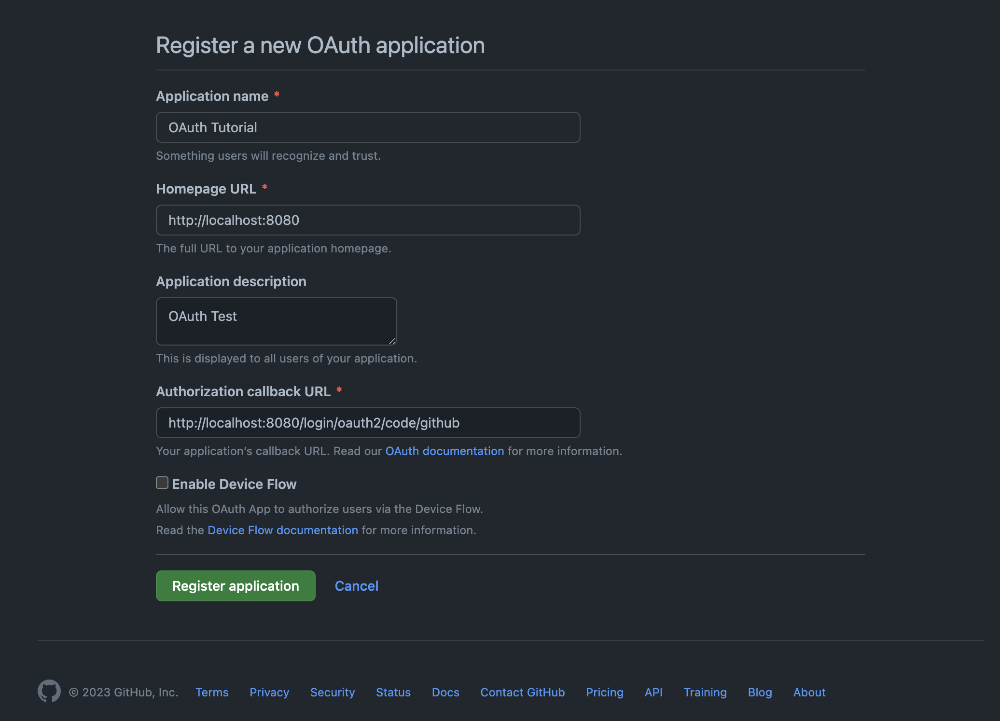
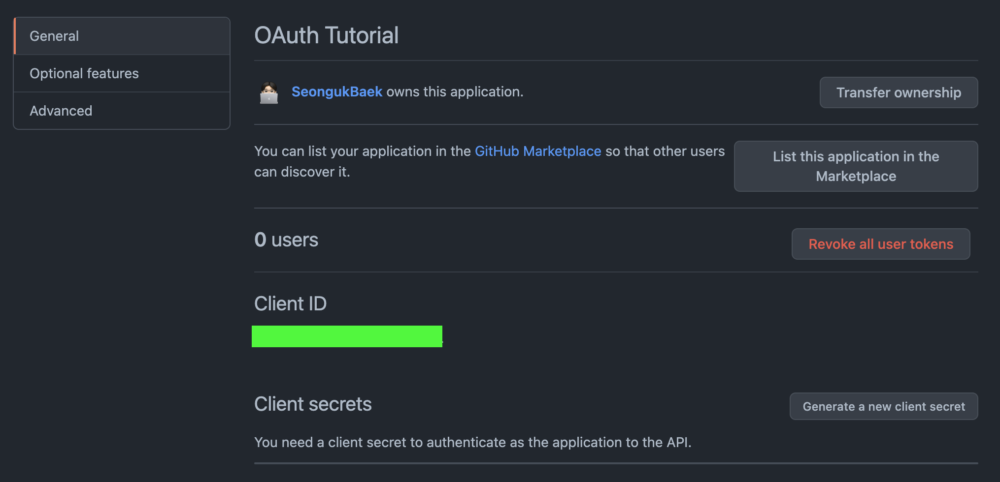
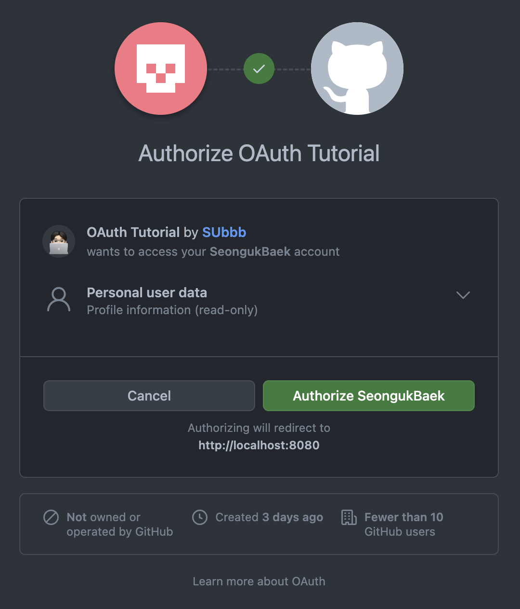

**Spring Security와 JWT를 사용하여 사용자 인증 구현**

TOC
- [Github 소셜 로그인](#github-소셜-로그인)
  - [Github OAuth app 생성](#github-oauth-app-생성)
    - [설정 정보](#설정-정보)
  - [액세스 토큰 발급](#액세스-토큰-발급)
- [참고](#참고)

## 목표
- ~~Spring Security를 통해 비밀번호를 암호화하여 **회원가입**~~
- ~~DB에 저장된 사용자의 계정과 비밀번호로 **로그인**~~
- **GitHub 소셜 로그인**
- **JWT**를 사용하여 로그인한 사용자에게 토큰 발급
- 인가된 토큰의 권한에 따라 API 접근 권한 제어
- Swagger UI 적용

---

# Github 소셜 로그인
이전까지는 Security를 이용해 회원가입 및 로그인하는 과정을 알아보았다. 이번에는 Github 소셜 로그인을 적용해보고자 한다.

이를 위해서는 OAuth에 대해서 알고 있어야 한다. 아래 정리한 글을 참고하자.
- [OAuth?](https://github.com/SeongukBaek/DevDevDev/blob/main/Backend/OAuth/OAuth.md)

<!-- 그리고 Spring이 제공하는 OAuth2의 기능을 사용하기 위해서는 다음과 같은 의존성을 추가해야 한다.

```gradle
implementation 'org.springframework.boot:spring-boot-starter-oauth2-client'
``` -->

## Github OAuth app 생성
Github의 OAuth를 사용하려면 먼저 OAuth를 사용할 App을 만들어야 한다.

[Developer Settings](https://github.com/settings/developers)의 `OAuth Apps` 에서 새로운 App을 생성하자.


- 로컬 환경에서 테스트할 예정이므로, 위와 같이 URL을 설정한다.
- 중요한 것은 **Authorization callback URL**이다.
  - 이는 사용자가 Github 로그인 후, 인가를 허용했을때 리다이렉트되는 URL이다.
  - 그리고 이 리다이렉트된 URL 뒤에 `?code={code}` 와 같이 인가 코드가 전달될 것이다. 이를 기반으로 사용자 정보 조회 등 우리가 하고자 하는 기능을 수행할 수 있다.

> 위는 Github의 기본 리다이렉션 URL 형식이다. google, facebook 또한 위와 같은 방식으로 사용할 수 있다.

### 설정 정보


- 방금 만든 Github OAuth App에 대한 정보이다.
- 여기서 필요한 것은 **Client ID, Client Secrets**이다.
- Client Secrets을 생성해서 복사해두자. (**다시 확인할 수 없다!**)

이제 Spring Security가 해당 정보를 사용할 수 있도록 `application.properties` 에 명시해주자.

```xml
# Security Setting
spring.security.oauth2.client.registration.github.client-id={id}
spring.security.oauth2.client.registration.github.client-secret={secret}
```

그리고 Spring에서 제공하는 OAuth2를 사용하기 위해 아래의 의존성을 추가하고, Configuration 파일에 OAuth 2.0 인증을 활성화하는 코드를 추가한다.

```
implementation 'org.springframework.boot:spring-boot-starter-oauth2-client'
```

```java
@Bean
public SecurityFilterChain filterChain(HttpSecurity http) throws Exception {
    http
            .csrf().disable()
            .authorizeHttpRequests((authz) -> authz
                    .antMatchers("/sign-up", "/sign-in").permitAll()
                    .anyRequest().authenticated()
            )
            .httpBasic(withDefaults())
            .oauth2Login();
    return http.build();
}
```

이제 localhost:8080으로 접근하면 아래와 같이 OAuth Tutorial, 우리가 만든 Github OAuth app에 대한 인가를 허용할 것인지를 묻는 화면을 볼 수 있다.



## 액세스 토큰 발급
이제 인가 이후의 상황이다. 사용자가 위 화면에서 **`Authorize`** 를 하게 되면, 처음에 지정했던 `Callback Url` + `?code={code}` 으로 리다이렉트할 것이다.
- 서버는 이 요청으로부터 Code값(= **인가 코드**)을 추출해, Github(**Authorization Server**)에 **액세스 토큰을 요청**해야 한다.
- 그리고 이 액세스 토큰을 통해 Github(Resource Server)로부터 **인가를 허가한 사용자에 대한 데이터를 받아올 수 있다**

그럼 우선, 인가 코드를 받을 API를 하나 생성하자.
- 기존의 컨트롤러를 `UserController` 로 변경하고, 새로운 `AuthController` 를 생성하자.

—
# 참고
- https://somuchthings.tistory.com/130
- https://bravenamme.github.io/2020/05/04/springboot-oauth2/
- https://www.baeldung.com/spring-security-5-oauth2-login
- https://deeplify.dev/back-end/spring/oauth2-social-login#%EC%8B%9C%ED%80%80%EC%8A%A4-%EC%84%A4%EB%AA%85
- https://github.com/sushistack/oauth-login-be/blob/master/src/main/java/com/deeplify/tutorial/oauthlogin