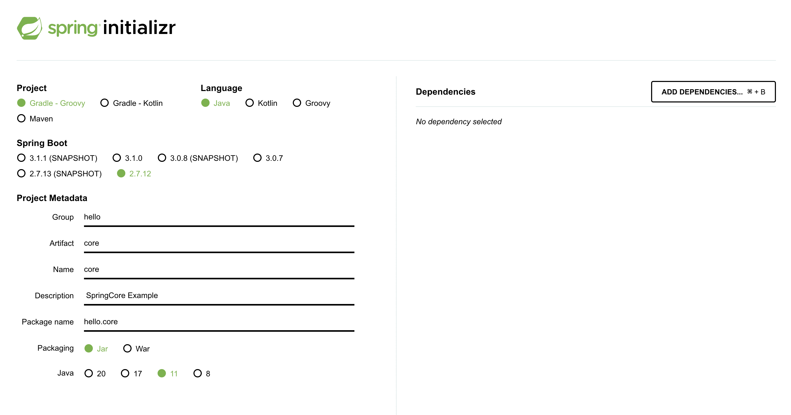
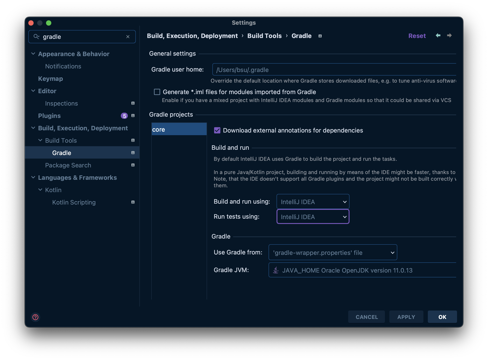
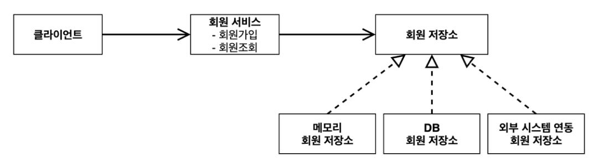
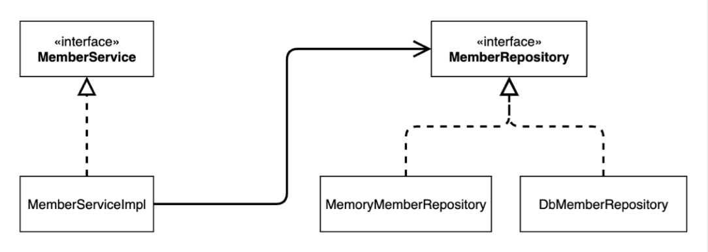
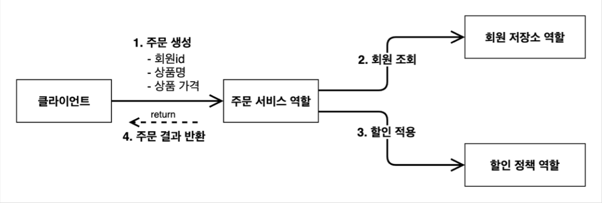
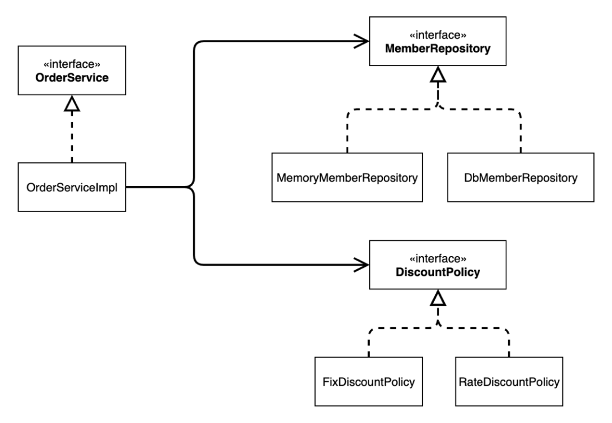

TOC
- [프로젝트 생성](#프로젝트-생성)
- [비즈니스 요구사항과 설계](#비즈니스-요구사항과-설계)
- [회원 도메인 설계](#회원-도메인-설계)
- [회원 도메인 개발](#회원-도메인-개발)
  - [회원 엔티티](#회원-엔티티)
- [회원 도메인 실행과 테스트](#회원-도메인-실행과-테스트)
  - [회원 도메인 설계의 문제점](#회원-도메인-설계의-문제점)
- [주문과 할인 도메인 설계](#주문과-할인-도메인-설계)
- [주문과 할인 도메인 개발](#주문과-할인-도메인-개발)
- [주문과 할인 도메인 실행과 테스트](#주문과-할인-도메인-실행과-테스트)

# 프로젝트 생성
[start.spring.io](https://start.spring.io/)를 이용한다.



(처음에 스프링 버전 3.0, 자바 11로 했다가 버전 지원이 안된다는 에러를 보고 찾아보니 스프링 3.0부터는 자바 17 이상을 지원한다고 했다. 따라서 스프링 버전을 낮춰 생성했다.)

스타터로 프로젝트 생성 시, 의존성을 추가하지 않았기에 아래와 같이 기본적인 라이브러리만 추가되어 있다.

```
dependencies {
	implementation 'org.springframework.boot:spring-boot-starter'
	testImplementation 'org.springframework.boot:spring-boot-starter-test'
}
```


- gradle을 통해 빌드 및 애플리케이션 실행을 수행하는 것은 느리다고 한다.
- 따라서 IntelliJ에서 자바를 바로 실행할 수 있도록 IntelliJ로 변경한다.

---

# 비즈니스 요구사항과 설계
- **회원**
  - 회원을 **가입하고 조회**할 수 있다.
  - 회원은 **일반**과 **VIP** 두 가지 등급이 있다.
  - 회원 데이터는 **자체 DB를 구축**할 수 있고, **외부 시스템과 연동**할 수 있다. **(미확정)**

- **주문과 할인 정책**
  - 회원은 **상품을 주문**할 수 있다.
  - **회원 등급에 따라 할인 정책을 적용**할 수 있다.
  - 할인 정책은 **모든 VIP는 1000원을 할인**해주는 고정 금액 할인을 적용해달라. (나중에 변경 될 수 있다.)
  - 할인 정책은 변경 가능성이 높다. 회사의 기본 할인 정책을 아직 정하지 못했고, 오픈 직전까지 고민을 미루고 싶다. 최악의 경우 할인을 적용하지 않을 수 도 있다. **(미확정)**

요구사항을 보면, 아직까지 미확정된 부분이 존재한다. 정책이 결정될 때까지 기다릴 수는 없기에, **인터페이스를 만들고, 구현체를 언제든 갈아끼울 수 있도록 설계하자!**

> 현재는 자바로만 개발을 진행한다.

---

# 회원 도메인 설계
**회원 도메인 협력 관계**


- 회원 저장소는 **메모리, 자체 DB, 외부 시스템 연동** 3가지 모두가 가능하도록 하기 위해 인터페이스로서 구현한다.
  - 추후, DB 정책이 확정되면 바로 갈아끼울 수 있게 하기 위함이다.
  - (현재는 가장 간단한 형태인 메모리 회원 저장소로 구현한다.)

**회원 클래스 다이어그램**


**회원 객체 다이어그램**
"클라이언트" -> "회원 서비스(`MemberServiceImpl`)" -> "메모리 회원 저장소"

> 객체 다이어그램 : 서버가 실제로 동작해서, 클라이언트가 실제로 사용하는 객체들의 관계를 나타낸다.

---

# 회원 도메인 개발
회원 클래스 다이어그램을 보고, 실제 코드를 구현한다.

## 회원 엔티티
**회원 등급**
- ENUM 클래스로 생성한다.

```java
public enum Grade {
    BASIC, VIP
}
```

**회원 엔티티**
```java
public class Member {
    private long id;
    private String name;
    private Grade grade;

    public Member(long id, String name, Grade grade) {
        this.id = id;
        this.name = name;
        this.grade = grade;
    }

    // Getter & Setter
}
```

**회원 저장소**
- 인터페이스와, 인터페이스 구현체(현재는 메모리 레포지토리)를 생성한다.
  - (인터페이스와 인터페이스 구현체를 서로 다른 패키지에 두는 것이 설계상 좋다고 한다!)
- 우선은 예외에 대한 처리는 모두 제외한다.

```java
public interface MemberRepository {
    /**
     * 회원을 저장한다.
     * */
    void save(Member member);

    /**
     * 주어진 memberId 값으로 회원을 조회해서 반환한다.
     * */
    Member findById(long memberId);
}
```
```java
public class MemoryMemberRepository implements MemberRepository {
    // 메모리 저장소이므로, 저장소 역할을 할 Map
    private static Map<Long, Member> store = new HashMap<>();

    @Override
    public void save(Member member) {
        store.put(member.getId(), member);
    }

    @Override
    public Member findById(long memberId) {
        return store.get(memberId);
    }
}
```

- 사실은 위에서 사용한 `HashMap`이 아닌 `ConcurrentHashMap`을 사용해야 한다. 아래 글을 통해 내부 동작을 보면, `resize()`가 온전히 완료되기 전, 다른 스레드에서 `get()`을 호출하게 되면, 정상적인 결과를 얻지 못하게 되는 것을 확인할 수 있다.
  - [HashMap이 스레드 안전하지 않은 이유 - 내부 동작](https://woooongs.tistory.com/67)

> 다중 스레드 환경에서는, `ConcurrentHashMap`을 사용하도록 하자!

**회원 서비스**
- 똑같이 인터페이스와 구현체를 생성한다.
  - 관례상 인터페이스의 구현체가 하나일때는, "인터페이스명 + Impl"로 구현체를 생성한다.

```java
public interface MemberService {
    void join(Member member);

    Member findMember(long memberId);
}
```
```java
public class MemberServiceImpl implements MemberService {
    private final MemberRepository memberRepository = new MemoryMemberRepository();

    @Override
    public void join(Member member) {
        memberRepository.save(member);
    }

    @Override
    public Member findMember(long memberId) {
        return memberRepository.findById(memberId);
    }
}
```

---

# 회원 도메인 실행과 테스트
`main()`에서 애플리케이션 로직을 테스트하는 것은 좋은 방법이 아니다. 따라서 JUnit을 사용해 테스트한다.

```java
// JUnit 5 사용
import org.junit.jupiter.api.Test;
import static org.junit.jupiter.api.Assertions.assertEquals;

public class MemberTest {
    private final MemberService memberService = new MemberServiceImpl();

    @Test
    public void join() {
        // given
        Member member = new Member(1L, "memberA", Grade.VIP);

        // when
        memberService.join(member);
        Member findMember = memberService.findMember(1L);

        // then
        assertEquals(member, findMember);
    }
}
```

## 회원 도메인 설계의 문제점
- 다른 저장소로 변경 시 OCP 원칙을 잘 준수하는가?
- DIP를 잘 지키고 있는가?
- **의존관계가 인터페이스 뿐만 아니라 구현까지 모두 의존하는 문제점**이 있다.

```java
// MemberServiceImpl.class
private final MemberRepository memberRepository = new MemoryMemberRepository();
```

-> **주문까지 만들고나서 문제점과 해결 방안을 설명**

---

# 주문과 할인 도메인 설계
**주문 도메인 협력, 역할, 책임**


1. 주문 생성: 클라이언트는 주문 서비스에 주문 생성을 요청한다.
2. 회원 조회: 할인을 위해서는 회원 등급이 필요하다. 그래서 주문 서비스는 회원 저장소에서 회원을 조회한다.
3. 할인 적용: 주문 서비스는 회원 등급에 따른 할인 여부를 할인 정책에 위임한다.
4. 주문 결과 반환: 주문 서비스는 할인 결과를 포함한 주문 결과를 반환한다.

**주문 도메인 클래스 다이어그램**


- 주문 서비스 구현체에서 사용하는 저장소와 할인 정책 인터페이스들의 각 구현체가 변경된다해도, **주문 서비스에서는 달라질 것이 없다!**

---

# 주문과 할인 도메인 개발
**할인 정책 인터페이스**
```java
public interface DiscountPolicy {
    /**
     * @return 할인 대상 금액
     * */
    int discount(Member member, int price);
}
```

**정액 할인 구현체**
```java
public class FixDiscountPolicy implements DiscountPolicy {
    private final int discountFixAmount = 1000;

    @Override
    public int discount(Member member, int price) {
        if (member.getGrade() == Grade.VIP) {
            return discountFixAmount;
        }
        return 0;
    }
}
```

**주문 엔티티**
```java
package hello.core.order;

public class Order {
    private long memberId;
    private String itemName;
    private int itemPrice;
    private int discountPrice;

    public Order(long memberId, String itemName, int itemPrice, int discountPrice) {
        this.memberId = memberId;
        this.itemName = itemName;
        this.itemPrice = itemPrice;
        this.discountPrice = discountPrice;
    }

    /**
     * 최종 계산된 금액
     * */
    public int calculatePrice() {
        return itemPrice - discountPrice;
    }
    
    // Getter & Setter

    @Override
    public String toString() {
        return "Order{" +
                "memberId=" + memberId +
                ", itemName='" + itemName + '\'' +
                ", itemPrice=" + itemPrice +
                ", discountPrice=" + discountPrice +
                '}';
    }
}
```

**주문 서비스 인터페이스**
```java
public interface OrderService {
    Order createOrder(long memberId, String itemName, int itemPrice);
}
```

**주문 서비스 구현체**
```java
public class OrderServiceImpl implements OrderService {
    // 회원 정보 조회를 위해 필요
    private final MemberRepository memberRepository = new MemoryMemberRepository();
    // 할인 정책 적용을 위해 필요
    private final DiscountPolicy discountPolicy = new FixDiscountPolicy();

    @Override
    public Order createOrder(long memberId, String itemName, int itemPrice) {
        Member member = memberRepository.findById(memberId);

        // 할인에 대해서는 createOrder는 아예 알지 못함, 단일 책임 원칙을 잘 지킨 예
        int discountPrice = discountPolicy.discount(member, itemPrice);

        return new Order(memberId, itemName, itemPrice, discountPrice);
    }
}
```

- 주문 생성 요청이 오면, 
  - 회원 정보를 조회하고, 
  - 할인 정책을 적용한 다음 주문 객체를 생성해서 반환한다. 

---

# 주문과 할인 도메인 실행과 테스트
```java
public class OrderServiceTest {
    private final MemberService memberService = new MemberServiceImpl();
    private final OrderService orderService = new OrderServiceImpl();

    @Test
    public void createOrder() {
        // given
        long memberId = 1L;
        Member member = new Member(memberId, "memberA", Grade.VIP);
        memberService.join(member);

        // when
        Order order = orderService.createOrder(memberId, "itmeA", 10000);

        // then
        assertEquals(order.getDiscountPrice(), 1000);
    }
}
```