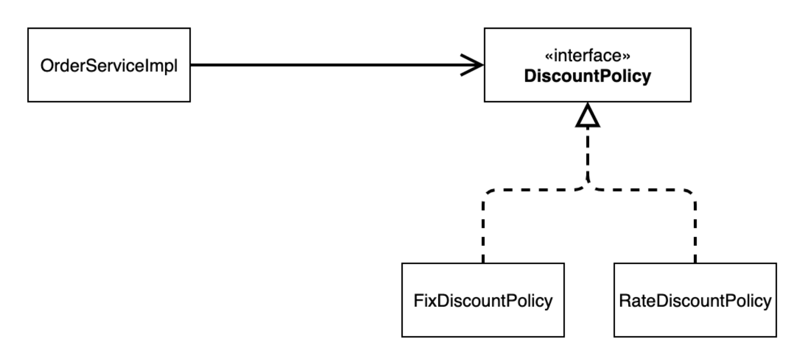
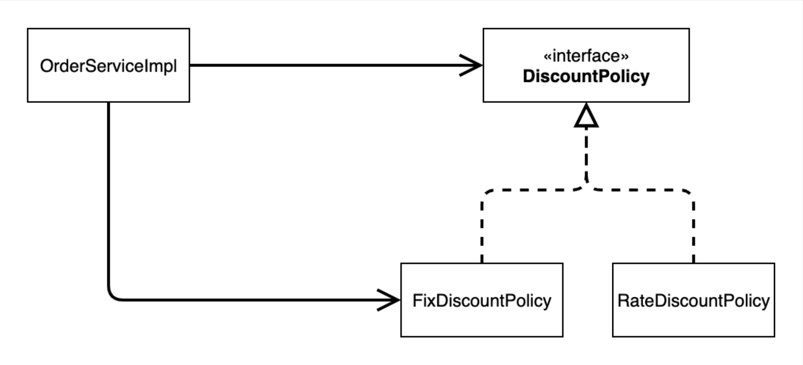
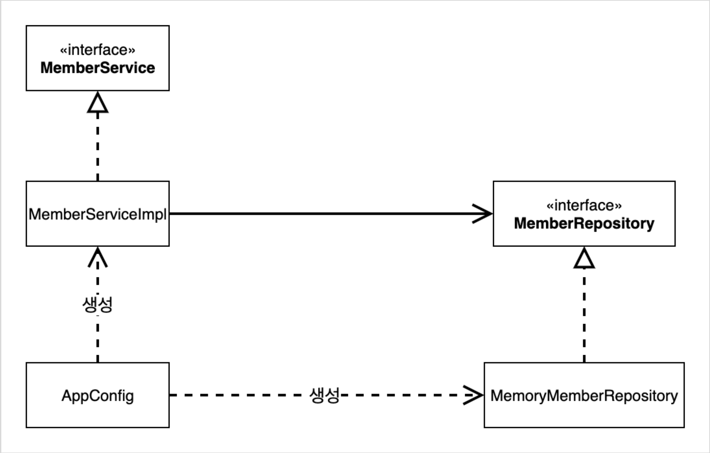
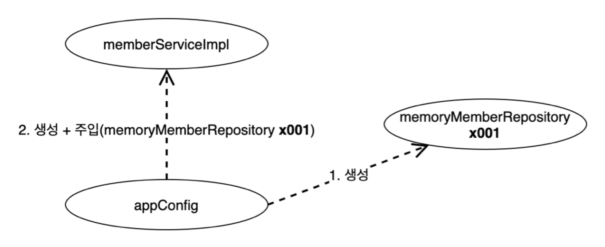
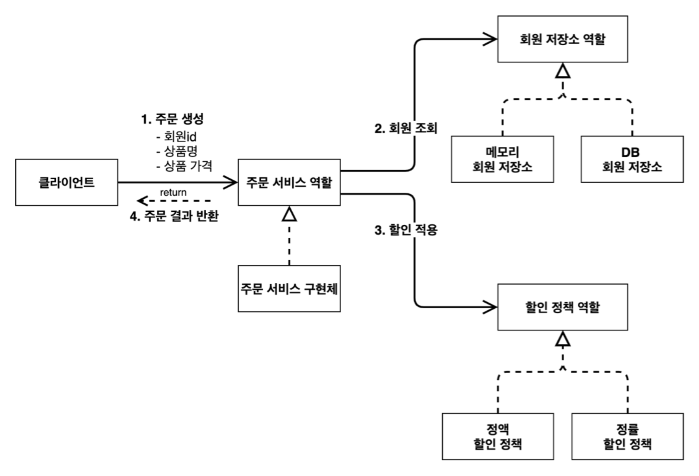
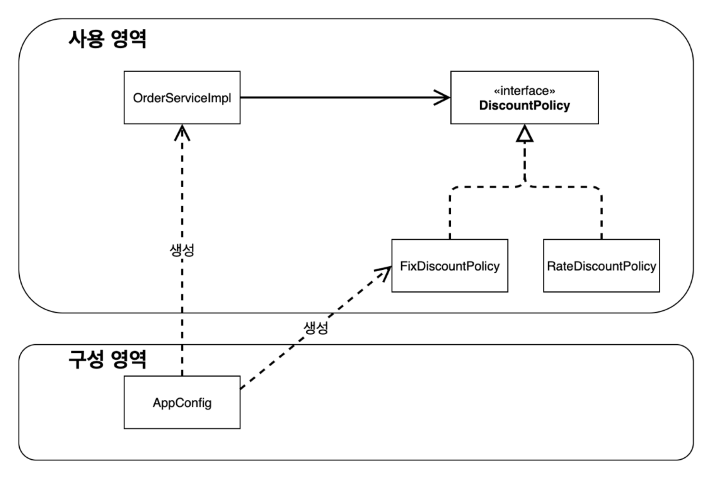

TOC
- [새로운 할인 정책 개발](#새로운-할인-정책-개발)
  - [RateDiscountPolicy 추가](#ratediscountpolicy-추가)
- [새로운 할인 정책 적용과 문제점](#새로운-할인-정책-적용과-문제점)
  - [할인 정책 적용](#할인-정책-적용)
  - [문제점](#문제점)
  - [클래스 다이어그램으로 확인](#클래스-다이어그램으로-확인)
- [관심사의 분리](#관심사의-분리)
  - [AppConfig 등장](#appconfig-등장)
- [AppConfig 실행](#appconfig-실행)
- [AppConfig 리팩토링](#appconfig-리팩토링)
- [새로운 구조와 할인 정책 적용](#새로운-구조와-할인-정책-적용)
- [좋은 객체 지향 설계의 5가지 원칙의 적용](#좋은-객체-지향-설계의-5가지-원칙의-적용)
  - [SRP 단일 책임 원칙](#srp-단일-책임-원칙)
  - [DIP 의존관계 역전 원칙](#dip-의존관계-역전-원칙)
  - [OCP 개방 폐쇄 원칙](#ocp-개방-폐쇄-원칙)
- [IoC, DI, 그리고 컨테이너](#ioc-di-그리고-컨테이너)
  - [제어의 역전 (Inversion of Control)](#제어의-역전-inversion-of-control)
  - [의존관계 주입 (Dependency Injection)](#의존관계-주입-dependency-injection)
  - [IoC 컨테이너, DI 컨테이너](#ioc-컨테이너-di-컨테이너)
- [스프링으로 전환하기](#스프링으로-전환하기)

> 새로운 할인 정책 개발을 요구받았다. 하지만 이를 개발하게 되면서, DIP, OCP 원칙을 깨트리는 문제가 발생한다.
> - 이를 해결하면서 스프링으로의 전환이 이뤄진다!

# 새로운 할인 정책 개발
기존의 정액 할인이 아닌, **정률 할인**으로 변경을 요구하는 상황이다.

## RateDiscountPolicy 추가


- 새로운 할인 정책 추가를 위해, `DiscountPolicy` 인터페이스를 구현할 새로운 클래스를 추가하자!
- 추가 이후에는 작성한 로직이 확실히 동작하는지 확인하기 위한 테스트 코드를 작성한다.

```java
public class RateDiscountPolicy implements DiscountPolicy {
    private final int discountPercent = 10;

    @Override
    public int discount(Member member, int price) {
        if (member.getGrade() == Grade.VIP) {
            return price * discountPercent / 100;
        }
        return 0;
    }
}
```
```java
public class RateDiscountPolicyTest {
    RateDiscountPolicy discountPolicy = new RateDiscountPolicy();
    @Test
    @DisplayName("VIP는 10% 할인이 적용되어야 한다.")
    void vip_o() {
        //given
        Member member = new Member(1L, "memberVIP", Grade.VIP);
        //when
        int discount = discountPolicy.discount(member, 10000);
        //then
        assertEquals(discount, 1000);
    }

    // 성공에 대한 테스트도 중요하지만, 실패에 대한 테스트 또한 중요하다.
    @Test
    @DisplayName("VIP가 아니면 할인이 적용되지 않아야 한다.")
    void vip_x() {
        //given
        Member member = new Member(2L, "memberBASIC", Grade.BASIC);
        //when
        int discount = discountPolicy.discount(member, 10000);
        //then
        assertEquals(discount, 0);
    }
}
```

---

# 새로운 할인 정책 적용과 문제점
## 할인 정책 적용
적용을 위해서는 클라이언트인 `OrderServiceImpl` 의 코드를 변경해야 한다.

```java
public class OrderServiceImpl implements OrderService {

    // private final DiscountPolicy discountPolicy = new FixDiscountPolicy();
    private final DiscountPolicy discountPolicy = new RateDiscountPolicy();
​
    ...
}
```

## 문제점
- [x] 역할과 구현을 충실하게 분리했다!
- [x] 다형성도 활용하고 인터페이스와 구현 객체를 분리했다!
- [ ] OCP, DIP와 같은 객체 지향 설계 원칙을 준수했다...?

**DIP**: 주문 서비스 클라이언트(`OrderServiceImpl`) 는 `DiscountPolicy` 인터페이스에 의존하면서 DIP를 지킨 것 같아 보이지만, 사실은 **구현 클래스(`FixDiscount...`, `RateDiscount...`)에도 의존하고 있다.**
- 정책의 변경을 위해 구현체 변경 코드가 필요했으니...!

**OCP**: 변경하지 않고 확장할 수 있어야 한다.
- 지금 코드는 기능을 확장해서 변경하면, 클라이언트 코드(`OrderServiceImpl`)에 영향을 주고 있다.
- 따라서 OCP 또한 위반하고 있다.

## 클래스 다이어그램으로 확인
**기대했던 의존관계**

- 위와 같이 인터페이스에 의존하고 있다고 기대했으나, 실제로는 아래와 같이 추상화와 구현체 모두에 의존하고 있다. -> **DIP 위반**
- 이후, 구현체 변경이 발생하면, 클라이언트 소스 코드의 변경이 발생한다. -> **OCP 위반**



**문제 해결**
> 인터페이스에만 의존하도록 변경해야 한다!

```java
public class OrderServiceImpl implements OrderService {
    //private final DiscountPolicy discountPolicy = new RateDiscountPolicy();
    private DiscountPolicy discountPolicy;
}
```
- 인터페이스에만 의존하기 위해서는 위와 같이 구현체를 선언하지 않도록 한다.
- 하지만 실행하게 되면, `NullPointerException` 이 발생할 것이다.

=> "누군가가 클라이언트인 `OrderServiceImpl` 에 **구현체를 대신 생성하고 주입**해줘야 한다!"

---

# 관심사의 분리
> 애플리케이션을 하나의 공연이라 생각해보자. 각각의 인터페이스를 배역(배우 역할)이라 생각하자. 그런데! **실제 배역 맞는 배우를 선택하는 것은 누가 하는가?**
>  로미오와 줄리엣 공연을 하면 로미오 역할을 누가 할지 줄리엣 역할을 누가 할지는 배우들이 정하는게 아니다. 이전 코드는 마치 로미오 역할(인터페이스)을 하는 레오나르도 디카프리오(구현체, 배우)가 줄리엣 역할(인터페이스)을 하는 여자 주인공(구현체, 배우)을 직접 초빙하는 것과 같다. 디카프리오는 공연도 해야하고 동시에 여자 주인공도 공연에 직접 초빙해야 하는 다양한 책임을 가지고 있다.

- 이를 현재 애플리케이션에 적용시켜보면, `OrderServiceImpl` 은 `OrderService` 와 관련된 로직만을 수행해야 하는데, `DiscountPolicy` 에 대한 객체 생성과 선택까지 수행하고 있는 것이다.

**관심사를 분리하자**
- 배우는 본인의 역할인 배역을 수행하는 것에만 집중해야 한다.
- 디카프리오는 어떤 여자 주인공이 선택되더라도 똑같이 공연을 할 수 있어야 한다.
- 공연을 구성하고, 담당 배우를 섭외하고, 역할에 맞는 배우를 지정하는 책임을 담당하는 별도의 공연 기획자가 나올 시점이다.
- 공연 기획자를 만들고, 배우와 공연 기획자의 책임을 확실히 분리하자.

## AppConfig 등장
애플리케이션의 전체 동작 방식을 **구성(Config)**하기 위해, **구현 객체를 생성하고 연결하는 책임**을 가지는 **별도의 설정 클래스**를 만든다.

```java
public class AppConfig {

    public MemberService memberService() {
        return new MemberServiceImpl(new MemoryMemberRepository());
    }
​
    public OrderService orderService() {
        return new OrderServiceImpl(new MemoryMemberRepository(), new FixDiscountPolicy());
    }
}
```
```java
public class MemberServiceImpl implements MemberService {
    private final MemberRepository memberRepository;

    // 생성자를 통해 인자로 전달받은 MemberRepository를 사용하도록 한다.
    public MemberServiceImpl(MemberRepository memberRepository) {
        this.memberRepository = memberRepository;
    }

    ...

}
```

- `AppConfig`가 `MemberService`를 만든다. 그리고 `MemberService`는 `MemoryMemberRepository`가 필요한데, 이 또한 생성자로서 할당해준다.
- `OrderServiceImpl` 또한 동일한 방식으로 한다.
- 이러한 방식을 **생성자 주입**이라 한다. (생성자를 통해 사용하는 클래스가 주입되므로!)

어디선가 `AppConfig` 의 메소드를 호출하면, `MemberServiceImpl` 과 `OrderServiceImpl` 이 생성되고, **생성한 객체 인스턴스의 "참조"를 생성자를 통해 주입**해준다.
- `MemberServiceImpl` -> `MemoryMemberRepository`
- `OrderServiceImpl` -> `MemoryMemberRepository` , `FixDiscountPolicy`

=> 이로써, **인터페이스에만 의존하게 되어 DIP를 위반하지 않게 되었다.**

`MemberServiceImpl` 입장에서, 생성자를 통해 어떤 구현 객체가 들어올 지(주입될 지)는 전혀 알 수 없다.
- 이는 클래스 내부가 아니라, **외부(AppConfig)**에서 결정된다.
- **의존관계에 대한 고민은 외부로 넘기고, 실행에만 집중하도록 한다!**

**클래스 다이어그램**

- `AppConfig` 가 이제 **객체의 생성과 연결을 담당**한다.
- **DIP 완성** : `MemberServiceImpl` 은 `MemberRepository` 인 추상 인터페이스에만 의존하면 된다. 구체 클래스는 몰라도 된다!
- **관심사의 분리** : 객체를 생성하고 연결하는 역할과(`AppConfig`), 실행하는 역할이(`MemberServiceImpl` , `OrderServiceImpl`) 명확히 분리되었다.

**회원 객체 인스턴스 다이어그램**

- `appConfig` 객체는 `memoryMemberRepository` 객체를 생성하고, **그 참조값**을 `memberServiceImpl` 을 생성하면서 생성자로 전달한다.
- 클라이언트(`memberServiceImpl`) 입장에서는 의존관계를 마치 외부에서 주입해주는 것과 같아 **DI(Dependency Injection), 의존관계 주입, 의존성 주입**이라 한다.

---

# AppConfig 실행
```java
public class MemberServiceTest {
    private MemberService memberService;

    @BeforeEach
    public void beforeEach() {
        AppConfig appConfig = new AppConfig();
        memberService = appConfig.memberService();
    }

    ...
}
```
- 이제 테스트 코드 또한 변경한다.
- `@BeforeEach` 를 통해 각 테스트 코드 실행 전 의존관계 주입을 수행한다.

---

# AppConfig 리팩토링
```java
public class AppConfig {
    public MemberService memberService() {
        return new MemberServiceImpl(new MemoryMemberRepository());
    }

    public OrderService orderService() {
        return new OrderServiceImpl(new MemoryMemberRepository(), new FixDiscountPolicy());
    }
}
```

- 현재 코드를 보면, `MemoryMemberRepository` 생성 코드가 중복되고, 역할에 따른 구현이 잘 보이지 않는다는 문제점이 있다.


- 각 역할과 구현을 분리하고 있는데, 설정 정보(`AppConfig`)를 보면, 이를 한 눈에 보기 어렵다.

```java
public class AppConfig {
    // memberService 역할
    public MemberService memberService() {
        return new MemberServiceImpl(memberRepository());
    }

    // memberRepository 역할
    private MemberRepository memberRepository() {
        return new MemoryMemberRepository();
    }

    // orderService 역할
    public OrderService orderService() {
        return new OrderServiceImpl(memberRepository(), discountPolicy());
    }

    // discountPolicy 역할
    private DiscountPolicy discountPolicy() {
        return new FixDiscountPolicy();
    }
}
```

=> 각 역할과 구현 클래스가 한눈에 보기 쉽도록 변경했다. 이제 구현체의 변경 시, 세부 메소드의 한 부분만 변경하면 된다!

---

# 새로운 구조와 할인 정책 적용
새로 개발한 정률 할인 정책을 적용한다.
- `AppConfig` 만 수정하면 된다!

> "`AppConfig` 의 등장으로 애플리케이션이 크게 사용 영역과 객체를 생성하고 구성하는 영역으로 분리되었다!"

**사용, 구성의 분리**


- 정액 할인 정책을 정률 할인 정책으로 변경하기 위해서는 `AppConfig` 의 코드를 고치면 되므로, **구성 영역만 영향을 받고, 사용 영역은 구애받지 않는다!**

---

# 좋은 객체 지향 설계의 5가지 원칙의 적용
크게 3가지 SRP, DIP, OCP 원칙이 적용되었다.

## SRP 단일 책임 원칙
**한 클래스는 하나의 책임만 가져야 한다.**

관심사의 분리를 통해,
- 구현 객체를 생성하고 연결하는 책임은 `AppConfig` 가 담당
- 실행하는 책임은 클라이언트 객체가 담당

## DIP 의존관계 역전 원칙
**추상화에 의존해야지, 구체화에 의존하면 안된다.**

새로운 할인 정책 개발 후 적용하려 할 때 클라이언트 코드의 변경을 요구했다.
- 이는 구체 클래스에 함께 의존하고 있었기 때문이었다.

따라서 추상화 인터페이스에만 의존하도록 코드를 변경했다.
- 클라이언트 코드는 인터페이스만으로 아무것도 실행할 수 없기에, `AppConfig` 를 통해 객체를 생성하고, 의존관계를 주입했다.

## OCP 개방 폐쇄 원칙
**소프트웨어 요소는 확장에는 열려 있으나 변경에는 닫혀 있어야 한다.**
- 다형성을 사용하고 클라이언트가 DIP를 지키게 되면, OCP 원칙이 적용될 가능성이 열린다.
- 애플리케이션을 사용 영역과 구성 영역으로 나눈다.
- 변경이 일어나도, 클라이언트 코드를 변경할 필요가 없게 되었으므로, 사용 영역에 대한 변경은 완전히 닫혀 있게 되었다.

---

# IoC, DI, 그리고 컨테이너
## 제어의 역전 (Inversion of Control)
> 제어의 역전은, 내가 뭔가를 호출하는 것이 아닌, 프레임워크 같은 개체가 호출하는 것을 의미한다.

기존 프로그램은 클라이언트 구현 객체가 스스로 필요한 서버 구현 객체를 생성하고, 연결하고, 실행했다. 한마디로 **"구현 객체가 프로그램의 제어 흐름을 스스로 조종"했다.**

`AppConfig` 가 등장한 이후, **구현 객체는 자신의 로직을 실행하는 역할**만을 담당한다.
- 프로그램 제어 흐름 자체를 `AppConfig` 가 가져간다.
- 예를 들어, `OrderServiceImpl` 은 필요한 인터페이스들을 호출하지만, 어떤 구현 객체들이 실행될지는 모른다!

프로그램에 대한 제어 흐름에 대한 권한은 모두 `AppConfig` 가 가지고 있다. 심지어 `OrderServiceImpl` 도 `AppConfig` 가 생성한다. 그리고 `AppConfig` 는 `OrderServiceImpl` 이 아닌 `OrderService` 인터페이스의 다른 구현 객체를 생성하고 실행할 수 도 있다. 그런 사실도 모른체 `OrderServiceImpl` 은 묵묵히 자신의 로직을 실행할 뿐이다.

**=> 프로그램의 제어 흐름을 직접 제어하는 것이 아니라 외부에서 관리하는 것을 제어의 역전이라 한다.**

## 의존관계 주입 (Dependency Injection)
의존관계는 **정적인 클래스 의존 관계**와, **실행 시점에 결정되는 동적인 객체(인스턴스) 의존 관계** 둘을 분리해서 생각해야 한다.

**정적인 클래스 의존관계**
- 클래스가 사용하는 `import` 코드만 보고 의존관계를 쉽게 판단할 수 있다. 정적인 의존관계는 **애플리케이션을 실행하지 않아도 분석할 수 있다.** (**클래스 다이어그램**을 통해서 확인할 수 있다.)
- ex. `OrderServiceImpl` 은 `MemberRepository` , `DiscountPolicy` 에 의존
- 하지만 이러한 정적인 관계만으로는 런타임에 실제 어떤 객체가 주입될지 알 수 없다.

**동적인 객체 인스턴스 의존관계**
- 애플리케이션 실행 시점에 실제 생성된 객체 인스턴스의 참조가 연결된 의존관계다.
- **객체 다이어그램**을 통해서 확인할 수 있다.
- 애플리케이션 실행 시점(**런타임**)에 외부에서 실제 구현 객체를 생성하고 클라이언트에 전달해서 클라이언트와 서버의 실제 의존관계가 연결되는 것을 **의존관계 주입**이라 한다.
  - **객체 인스턴스를 생성하고, 그 참조값을 전달**해서 연결된다.
  - 의존관계 주입을 사용하면 클라이언트 코드를 변경하지 않고, 클라이언트가 호출하는 대상의 타입 인스턴스를 변경할 수 있다.
  - 의존관계 주입을 사용하면 **정적인 클래스 의존관계를 변경하지 않고, 동적인 객체 인스턴스 의존관계를 쉽게 변경**할 수 있다.

## IoC 컨테이너, DI 컨테이너
`AppConfig` 처럼 객체를 생성하고 관리하면서 의존관계를 연결해 주는 것을 **IoC 컨테이너 또는 DI 컨테이너**라 한다.

의존관계 주입에 초점을 맞추어 최근에는 주로 DI 컨테이너라 한다. 또는 어샘블러, 오브젝트 팩토리 등으로 불리기도 한다.

---

# 스프링으로 전환하기
```java
@Configuration
public class AppConfig {
​
    @Bean
    public MemberService memberService() {
        return new MemberServiceImpl(memberRepository());
    }
​
    @Bean
    public MemberRepository memberRepository() {
        return new MemoryMemberRepository();
    }
​
    @Bean
    public OrderService orderService() {
        return new OrderServiceImpl(
                memberRepository(),
                discountPolicy()
        );
    }
​
    @Bean
    public DiscountPolicy discountPolicy() {
//        return new FixDiscountPolicy();
        return new RateDiscountPolicy();
    }
}
```
- `@Configuration` : 애플리케이션의 구성 정보를 담당하는 클래스에 사용한다.
- `@Bean` : 스프링 컨테이너에 등록하기 위해 사용한다.

`main()` 에서 사용해보면 아래와 같다.

```java
public static void main(String[] args) {
//  AppConfig appConfig = new AppConfig();
//  MemberService memberService = appConfig.memberService();
​
    ApplicationContext applicationContext = new AnnotationConfigApplicationContext(AppConfig.class);
    MemberService memberService = applicationContext.getBean("memberService", MemberService.class);
​
    Member member = new Member(1L, "memberA", Grade.VIP);
    memberService.join(member);
​
    Member findMember = memberService.findMember(1L);
    System.out.println("new Member = " + member.getName());
    System.out.println("findMember = " + findMember.getName());
}
```
- `ApplicationContext` : 스프링 컨테이너를 의미한다고 봐도 된다. 등록된 객체들을 관리한다.
- `AnnotationConfigApplicationContext` : annotation 기반으로 configuration을 한 구성 정보를 가지고 만든 애플리케이션의 context를 가져온다.
  - 생성자에 전달하는 클래스의 환경 설정 정보를 스프링 컨테이너에 등록하도록 한다.
- `getBean(String name = "", Class<T> requiredType)` : 컨테이너에 등록된 빈 중 `name` 과 `requiredType` 에 해당되는 객체를 가져온다.

**스프링 컨테이너**
- `ApplicationContext` 를 스프링 컨테이너라 한다.
- 기존에는 개발자가 `AppConfig` 를 사용해서 직접 객체를 생성하고 DI를 했지만, 이제부터는 스프링 컨테이너를 통해서 사용한다.
- 스프링 컨테이너는 `@Configuration` 이 붙은 `AppConfig` 를 설정(구성) 정보로 사용한다. 여기서 `@Bean` 이라 적힌 **메서드를 모두 호출**해서 **반환된 객체를 스프링 컨테이너에 등록**한다. 이렇게 스프링 컨테이너에 등록된 객체를 **스프링 빈**이라 한다.
- 스프링 빈은 `@Bean` 이 붙은 메서드의 명을 스프링 빈의 이름으로 사용한다. ( `memberService` , `orderService` )
- 이전에는 개발자가 필요한 객체를 `AppConfig` 를 사용해서 직접 조회했지만, 이제부터는 스프링 컨테이너를 통해서 필요한 스프링 빈(객체)를 찾아야 한다. 스프링 빈은 `applicationContext.getBean()` 를 사용해서 찾을 수 있다.
- 기존에는 개발자가 직접 자바코드로 모든 것을 했다면 이제부터는 **스프링 컨테이너에 객체를 스프링 빈으로 등록하고, 스프링 컨테이너에서 스프링 빈을 찾아서 사용**하도록 변경되었다.