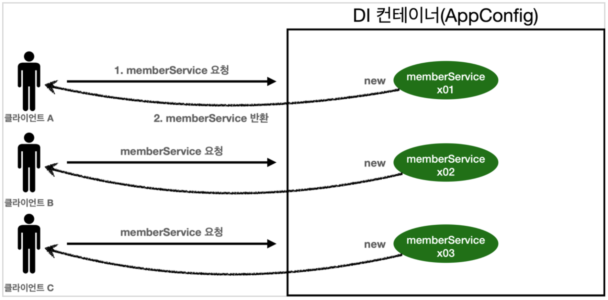
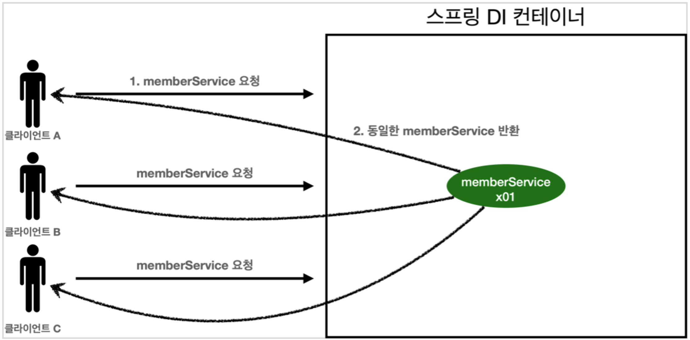
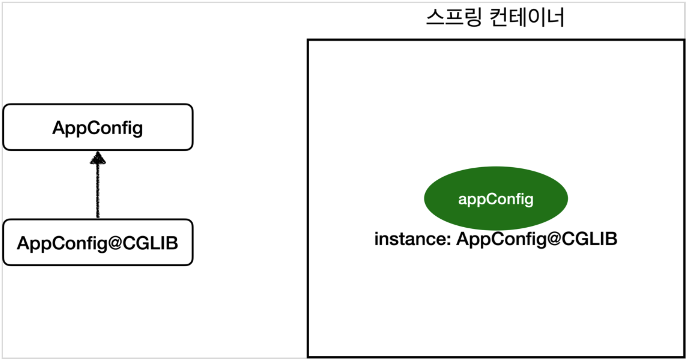
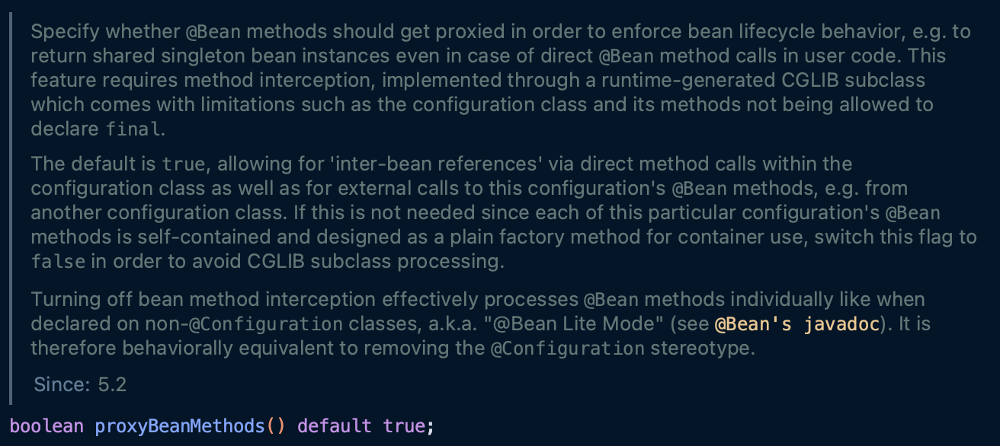

TOC
- [웹 애플리케이션과 싱글톤](#웹-애플리케이션과-싱글톤)
- [싱글톤 패턴](#싱글톤-패턴)
- [싱글톤 컨테이너](#싱글톤-컨테이너)
- [싱글톤 방식의 주의점](#싱글톤-방식의-주의점)
- [@Configuration과 싱글톤](#configuration과-싱글톤)
- [@Configuration과 바이트코드 조작의 마법](#configuration과-바이트코드-조작의-마법)
  - [@Configuration 없이 @Bean만 적용하면 어떻게 될까?](#configuration-없이-bean만-적용하면-어떻게-될까)

# 웹 애플리케이션과 싱글톤
대부분의 스프링 애플리케이션은 웹 애플리케이션이다.
- 그리고 웹 애플리케이션은 보통 여러 고객이 동시에 요청을 한다.



- 클라이언트 A, B, C가 서비스를 요청한다.
  - 그리고 이러한 요청 처리를 위해 처리할 객체를 생성해서 반환해준다.

> 이렇게 되면, 매 요청마다 매번 동일한 새로운 객체를 반복적으로 만들어야 한다는 문제점이 있다.

**스프링 없는 순수한 DI 컨테이너 테스트**

```java
public class SingletonTest {
    @Test
    @DisplayName("스프링 없는 순수한 DI 컨테이너")
    void pureContainer() {
        AppConfig appConfig = new AppConfig();

        // 1. 조회: 호출할 때마다 객체를 생성
        MemberService memberService1 = appConfig.memberService();

        // 2. 조회: 호출할 때마다 객체를 생성
        MemberService memberService2 = appConfig.memberService();

        // 참조값이 다른지 확인
        System.out.println("memberService1 = " + memberService1);
        System.out.println("memberService2 = " + memberService2);

        assertNotEquals(memberService1, memberService2);
    }
}
```

- 이전에 만든 스프링 없는 순수한 DI 컨테이너인 `AppConfig` 는 요청마다 객체를 새로 생성한다.
  - **고객 트래픽이 초당 100**이라고 가정하면, **초당 100개의 객체를 생성하고 소멸**한다. 이는 **심각한 메모리 낭비를 초래**한다.

> 이를 해결하기 위해서는 **사용하는 객체를 딱 1개만 생성**하고, **이를 공유**하도록 설계하면 된다!

---

# 싱글톤 패턴
**클래스의 인스턴스가 딱 1개만 생성되는 것을 보장**하는 디자인 패턴이다.
- 따라서, 객체 인스턴스를 **2개 이상 생성하지 못하도록 막아야 한다!**
- 이를 위해, `private` 생성자를 이용해 외부에서 임의로 `new` 키워드를 사용하지 못하도록 막아야 한다.

```java
public class SingletonService {
    //1. static 영역에 객체를 딱 1개만 생성해둔다.
    private static final SingletonService instance = new SingletonService();

    //2. public으로 열어서 객체 인스턴스가 필요하면 이 static 메서드를 통해서만 조회하도록 허용한다.
    public static SingletonService getInstance() {
        return instance;
    }

    //3. 생성자를 private으로 선언해서 외부에서 new 키워드를 사용한 객체 생성을 못하게 막는다. 
    private SingletonService() {

    }

    public void logic() { 
        System.out.println("싱글톤 객체 로직 호출");
    } 
}
```

- `static` 으로 자기 자신 객체를 선언해두면, 이는 클래스 레벨에 종속되는 객체로 딱 1개가 만들어진다.
  - `static` 메모리 영역에 할당된다.
- 위와 같이 `getInstance()` 를 통해 생성해놓은 `SingletonService` 를 반환받을 수 있도록 구현한다.
  - 그리고 해당 메소드의 반환 값은 항상 같은 값이다.
- 하지만 외부에서 임의로 `new SingletonService()` 를 호출한다면, 여러 개의 인스턴스를 생성하게 된다.
  - 따라서 생성자 자체를 `private` 으로 선언해서, 외부에서 호출할 수 없도록 한다!
  - 이렇게 하게 되면, 해당 클래스는 상속받을 수 없게 될 것이다.

위 코드에 대한 테스트 코드는 다음과 같다.

```java
@Test
@DisplayName("싱글톤 패턴을 적용한 객체 사용") 
public void singletonServiceTest() {
    //private으로 생성자를 막아두었다. 컴파일 오류가 발생한다. //new SingletonService();
    //1. 조회: 호출할 때 마다 같은 객체를 반환
    SingletonService singletonService1 = SingletonService.getInstance();
    //2. 조회: 호출할 때 마다 같은 객체를 반환
    SingletonService singletonService2 = SingletonService.getInstance();

    //참조값이 같은 것을 확인
    System.out.println("singletonService1 = " + singletonService1); System.out.println("singletonService2 = " + singletonService2);

    // singletonService1 == singletonService2
    assetEquals(singletonService1, singletonService2);

    singletonService1.logic();
}
```

> 싱글톤 패턴을 구현하는 방법은 매우 많다. 여기서는 객체를 미리 생성해두는 가장 단순하고 안전한 방법을 구현했다.
> - [싱글톤 패턴을 구현하는 방법](https://readystory.tistory.com/116)

싱글톤 패턴은 지금까지 구현한 것과 같이, 하나의 객체를 재사용하는 방식으로, 효율적인 방식이라고 할 수 있다.
하지만, 이러한 패턴은 다음과 같은 **문제점**이 있다.
- 싱글톤 패턴을 구현하는 코드 자체가 많이 들어간다.
- 의존관계상 클라이언트가 구체 클래스에 의존한다. -> **DIP 위반!!!**
- 클라이언트가 구체 클래스에 의존해서 **OCP 원칙을 위반할 가능성**이 높다.
- 테스트가 어렵다.
- 내부 속성을 변경하거나 초기화하기 어렵다.
- `private` 생성자로 인해 자식 클래스를 만들기 어렵다.
  - 상속 시, 부모 클래스의 생성자를 호출할 수 없기 때문이다.
- 결론적으로 유연성이 떨어진다. (DI의 적용을 어렵게 함)
- 안티 패턴으로 불리기도 한다.

---

# 싱글톤 컨테이너
스프링 컨테이너는 **싱글톤 패턴의 문제점을 해결**하면서, **객체 인스턴스를 싱글톤(1개만 생성)으로 관리**한다.
- 지금까지 배운 스프링 빈이 바로 싱글톤 패턴으로 관리된다!

**싱글톤 컨테이너?**
- 스프링 컨테이너는 싱글톤 패턴을 적용하지 않아도, **객체 인스턴스를 싱글톤으로 관리**한다.
  - 이전에 다룬 컨테이너 생성 과정을 자세히 보면, **컨테이너는 객체를 하나만 생성해서 관리**한다.
- 따라서 **스프링 컨테이너는 싱글톤 컨테이너 역할**을 한다. 이렇게 싱글톤 객체를 생성하고 관리하는 기능을 **싱글톤 레지스트리**라 한다.
- 스프링 컨테이너의 이런 기능덕에 싱글톤 패턴의 모든 단점을 해결하면서 객체를 싱글톤으로 유지할 수 있다.
  - 지저분한 코드가 들어가지 않아도 된다.
  - DIP, OCP, 테스트, `private` 생성자로부터 자유롭게 싱글톤을 사용할 수 있다.

**스프링 컨테이너를 사용하는 테스트 코드**
```java
@Test
@DisplayName("스프링 컨테이너와 싱글톤")
void springContainer() {
    ApplicationContext ac = new AnnotationConfigApplicationContext(AppConfig.class);
    
    //1. 조회: 호출할 때 마다 같은 객체를 반환
    MemberService memberService1 = ac.getBean("memberService", MemberService.class);

    //2. 조회: 호출할 때 마다 같은 객체를 반환
    MemberService memberService2 = ac.getBean("memberService", MemberService.class);

    //참조값이 같은 것을 확인
    System.out.println("memberService1 = " + memberService1); 
    System.out.println("memberService2 = " + memberService2);

    //memberService1 == memberService2
    assertEquals(memberService1, memberService2);
}
```

- 스프링 컨테이너에 등록한 빈이 계속 조회되어 같은 참조값을 가지는 것을 확인할 수 있다.
  - 그리고 `MemberService` 코드를 확인해보아도, 싱글톤과 관련된 코드는 하나도 없는 것을 확인할 수 있다.


- 스프링 컨테이너 덕분에 고객의 요청마다 객체를 생성하는 것이 아닌 **이미 만들어진 객체를 공유해서 효율적인 재사용이 가능해졌다.**

> 스프링의 기본 빈 등록 방식은 싱글톤이지만, 싱글톤 방식만 지원하는 것은 아니다.
> - 요청마다 새로운 객체를 생성해서 반환하는 기능도 제공하긴 한다. -> 빈 스코프와 관련된 내용!

---

# 싱글톤 방식의 주의점
싱글톤 패턴이든, 스프링과 같은 싱글톤 컨테이너를 사용하든, **객체 인스턴스를 하나만 생성해서 공유**하는 싱글톤 방식은 **여러 클라이언트가 하나의 같은 객체 인스턴스를 공유**하기에, 싱글톤 객체는 상태를 유지하게 설계하면 안된다!
- 즉, **무상태(stateless)**로 설계해야 한다!
  - 특정 클라이언트에 의존적인 필드가 있으면 안된다! (특정 클라이언트가 값을 바꾸게 두면 안된다!)
  - 특정 클라이언트가 값을 변경할 수 있는 필드가 있으면 안된다!
  - 가급적 읽기만 가능해야 한다. (값의 수정이 없도록 해야 한다.)
  - 필드 대신에 자바에서 공유되지 않는 **지역변수, 파라미터, ThreadLocal 등**을 사용해야 한다.

스프링 빈의 필드에 공유 값을 설정하면 정말 큰 장애가 발생할 수 있다..!
- 싱글톤 빈일 경우!

**상태를 유지할 경우 발생하는 문제점 예시**
```java
public class StatefulService {
    // 상태를 유지하는 필드
    private int price;

    public void order(String name, int price) {
        System.out.println("name = " + name + " price = " + price);

        // 여기가 문제!!!
        this.price = price;
    }

    public int getPrice() {
        return price;
    }
}
```
```java
public class StatefulServiceTest {
    @Test
    void statefulServiceSingleton() {
        // TestConfig로 ac 생성
        ApplicationContext ac = new AnnotationConfigApplicationContext(TestConfig.class);
        StatefulService statefulService1 = ac.getBean(StatefulService.class);
        StatefulService statefulService2 = ac.getBean(StatefulService.class);

        // ThreadA: A 사용자가 10000원 주문
        statefulService1.order("userA", 10000);
        // ThreadB: B 사용자가 20000원 주문
        statefulService2.order("userB", 20000);

        // ThreadA: A 사용자가 주문 금액 조회 -> 과연 얼마가 나올까?
        int price = statefulService1.getPrice();

        System.out.println("price = " + price);

        assertEquals(statefulService1.getPrice(), 20000);
    }

    static class TestConfig {
        // 스프링 빈으로 등록
        @Bean
        public StatefulService statefulService() {
            return new StatefulService();
        }
    }
}
```
- `StatefulServiceTest` 의 출력문에서 기대한 값은 **10000원**이다.
  - 사용자 A가 주문한 금액이 10000원이고, 이를 다시 조회한 것이므로 10000원을 기대했다.
- 하지만, 중간에 사용자 B의 주문이 끼어들어 기대와 다른 값이 출력되었다. (사용자 B의 주문이 `StatefulService` 의 `price` 필드를 20000으로 변경!!!)
- 그리고, `statefulService1` 과 `statefulService2` 로 다른 인스턴스를 사용했다해도, 사실 둘은 **같은 참조값을 갖는 인스턴스이기에 동일**하다.
- 이를 해결하기 위해 `order` 를 `int` 형으로 변환하고, `price` 필드 제거, `price` 를 반환하는 형태로 바꿀 수 있다.

> 이와 같이 상태를 유지하는 필드는 싱글톤인 경우 공유되기 때문에, 의도치 않은 결과를 낳을 수 있다. 따라서 스프링 빈은 무상태로 설계하자!

---

# @Configuration과 싱글톤
이전에 작성했던 `AppConfig` 코드를 다시 보면, 싱글톤이 유지되지 않는 것 같다!

```java
@Configuration
public class AppConfig {

    @Bean
    public MemberService memberService() {
        return new MemberServiceImpl(memberRepository());
    }

    @Bean
    public MemberRepository memberRepository() {
        return new MemoryMemberRepository();
    }

    @Bean
    public OrderService orderService() {
        return new OrderServiceImpl(
                memberRepository(),
                discountPolicy()
        );
    }

    ...
}
```
- `memberService` 빈을 만드는 코드를 보면, `memberRepository()` 를 호출한다.
  - 이때 `new MemoryMemberRepository()` 를 호출한다.
- `orderService` 빈을 만드는 코드를 보면, 동일하게 `memberRepository()` 를 호출한다.
  - 이때 `new MemoryMemberRepository()` 를 호출한다.

**결과적으로 각각 다른 2개의 `MemoryMemberRepository` 가 생성되면서 싱글톤이 깨지는 것처럼 보인다!!!**

> `@Configuration`은 싱글톤을 위해 존재한다.

우선, 테스트를 위해 각 `ServiceImpl` 코드에 `MemberRepository` 를 조회하는 Getter를 추가한다.

```java
public class ConfigurationSingletonTest {
    @Test
    void configurationTest() {
        ApplicationContext ac = new AnnotationConfigApplicationContext(AppConfig.class);

        MemberServiceImpl memberService = ac.getBean(MemberServiceImpl.class);
        OrderServiceImpl orderService = ac.getBean(OrderServiceImpl.class);
        MemberRepository memberRepository = ac.getBean("memberRepository", MemberRepository.class);

        MemberRepository memberRepository1 = memberService.getMemberRepository();
        MemberRepository memberRepository2 = orderService.getMemberRepository();

        // 모두 같은 인스턴스를 참조하고 있다.
        System.out.println("memberService -> memberRepository = " + memberRepository1);
        System.out.println("orderService -> memberRepository = " + memberRepository2);
        System.out.println("memberRepository = " + memberRepository);

        assertEquals(memberService.getMemberRepository(), memberRepository);
        assertEquals(orderService.getMemberRepository(), memberRepository);
    }
}
```

- 테스트 결과를 확인하면, 성공하는 것을 확인할 수 있다.
- 각각 서로 `new MemoryMemberRepository()` 를 호출했는데 어떻게 가능한 것일까..?
  - `memberService()` , `@Bean` 으로 인한 빈 등록 시 호출, `orderService()` 로 총 3번의 호출이 될텐데 .. ?!
  - `AppConfig` 에서 각 메소드마다 출력문을 작성해 실행하면 출력 결과는 메소드 모두 각 1번씩만 호출되어 총 3개의 출력문(`DiscountPolicy` 제외)을 확인할 수 있다.
    - `memberService()`
    - `memberRepository()`
    - `orderService()`
    - `memoryRepository` 는 3번 호출되어야 하지 않을까?

> 어떻게 된 것일까? 이에 대한 해답은 `AppConfig` 에서 사용된 `@Configuration` 에 있다.

---

# @Configuration과 바이트코드 조작의 마법
스프링 컨테이너는 **싱글톤 레지스트리**다. 따라서 스프링 빈이 싱글톤이 되도록 보장해야 한다!
- 하지만 스프링이 자바 코드까지 어떻게 할 수는 없다.
- 위에서 저 자바 코드만 봤을때, 분명 `memberRepository()` 는 3번 호출되어야 하는 것이 맞다.
  
스프링은 **클래스의 바이트코드를 조작하는 라이브러리를 사용**한다.
- `@Configuration` 을 적용한 `AppConfig` 를 확인해보면 알 수 있다.

우선, 간단한 확인 코드를 보자.
```java
@Test
void configurationDeep() {
    // AppConfig 또한 빈으로 등록됨!!!
    ApplicationContext ac = new AnnotationConfigApplicationContext(AppConfig.class);
​
    AppConfig bean = ac.getBean(AppConfig.class);
​
    System.out.println("bean = " + bean.getClass());
    // 출력: bean = class hello.core.AppConfig$$EnhancerBySpringCGLIB$$79b7202a
}
```

- AppConfig 또한 스프링 빈으로 등록된다는 것은 앞서 설명했다.
  - 이때 등록한 AppConfig 정보를 출력해보면 다음과 같은 값이 출력된다.
  - `bean = class hello.core.AppConfig$$EnhancerBySpringCGLIB$$79b7202a`

여기서 주목해야 하는 부분은 `xxxCGLIB` 이다.
- 이는 내가 만든 `AppConfig` 가 아니라, 스프링이 `CGLIB` 라는 바이트코드 조작 라이브러리를 사용해 **`AppConfig` 클래스를 상속받은 임의의 다른 클래스를 만들고, 이를 스프링 빈으로 등록**한 것이다!!!
- 아래 그림을 통해 이해할 수 있다.


- 그리고 이 임의의 클래스가 **싱글톤이 보장**되도록 한다.
- 그리고 이 과정은 `@Configuration` 어노테이션을 통해 수행된다.



- `@Configuration` 코드를 보면, 해당 부분이 `true` 로 설정되어, 등록된 싱글톤 빈 인스턴스를 반환하도록 해주는 것 같다!

**AppConfig@CGLIB 예상 코드**
```java
@Bean
public MemberRepository memberRepository() {
    if (memoryMemberRepository가 이미 스프링 컨테이너에 등록되어 있으면?) { 
        return 스프링 컨테이너에서 찾아서 반환;
    } else { //스프링 컨테이너에 없으면
        기존 로직을 호출해서 MemoryMemberRepository를 생성하고 스프링 컨테이너에 등록 
        return 반환
    } 
}
```

- `@Bean` 이 붙은 메소드마다 이미 스프링 빈이 존재하면, 존재하는 빈을 반환하고, 없다면 생성해서 스프링 빈으로 등록하고 반환하는 코드가 동적으로 만들어진다.

-> 이 덕분에 싱글톤이 보장된다.

> `AppConfig@CGLIB` 는 `AppConfig` 의 자식 타입이므로, `AppConfig` 타입으로 조회 할 수 있다.

## @Configuration 없이 @Bean만 적용하면 어떻게 될까?
`@Bean` 만 적용해서 **CGLIB** 기술을 사용하지 않으면 어떻게 될까?

`@Configuration` 삭제 후, 
- 다시 출력을 보면 `bean = class hello.core.AppConfig` 와 같이 순수한 `AppConfig` 로 스프링 빈에 등록된 것을 확인할 수 있다.
- 하지만! 싱글톤이 보장되지 않아, **빈 등록 시 호출되는 출력문이 총 5번 출력**되는 것을 확인할 수 있다. (`MemberRepository` 가 매번 호출됨)

**=> 당연히 모두 다른 인스턴스로 생성될 것이다!!!**

> **`@Bean` 만 사용하면 싱글톤이 보장되지 않는다!**
> - `memberRepository()` 처럼 의존관계 주입이 필요해서 **메소드를 직접 호출할 때 싱글톤을 보장하지 않는다.**
> 
> 스프링 설정 정보는 항상 `@Configuration` 을 명시하여 싱글톤을 보장하도록 하자.