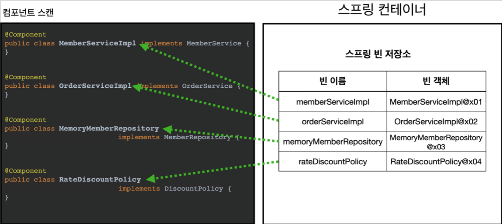
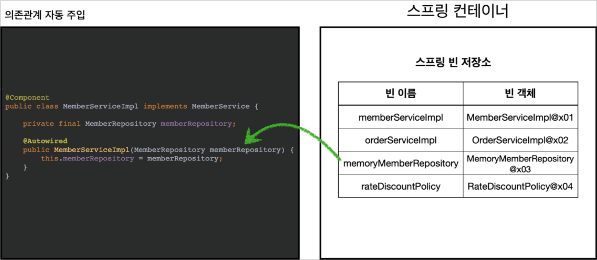
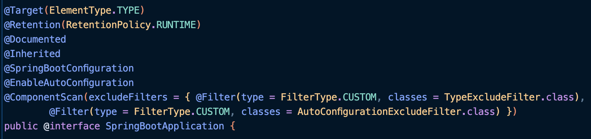

TOC
- [컴포넌트 스캔과 의존관계 자동 주입 시작하기](#컴포넌트-스캔과-의존관계-자동-주입-시작하기)
  - [@Component 추가](#component-추가)
  - [@Autowired 추가](#autowired-추가)
  - [Test 코드](#test-코드)
  - [@ComponentScan 동작 방식](#componentscan-동작-방식)
  - [@Autowired 의존관계 자동 주입 동작 방식](#autowired-의존관계-자동-주입-동작-방식)
- [탐색 위치와 기본 스캔 대상](#탐색-위치와-기본-스캔-대상)
  - [탐색할 패키지의 시작 위치 지정](#탐색할-패키지의-시작-위치-지정)
  - [컴포넌트 스캔 기본 대상](#컴포넌트-스캔-기본-대상)
- [필터](#필터)
  - [FilterType 옵션](#filtertype-옵션)
- [중복 등록과 충돌](#중복-등록과-충돌)
  - [자동 빈 등록 vs. 자동 빈 등록](#자동-빈-등록-vs-자동-빈-등록)
  - [수동 빈 등록 vs. 자동 빈 등록](#수동-빈-등록-vs-자동-빈-등록)

# 컴포넌트 스캔과 의존관계 자동 주입 시작하기
지금까지는 수동적으로 자바 코드의 `@Bean` 이나 XML의 `<bean>` 등을 통해 설정 정보에 직접 등록할 스프링 빈들을 명시했다.
- 등록해야 할 빈들이 많아진다면 ... 매우 비효율적인 과정일 것이다.

**=> 스프링은 설정 정보가 없어도 자동으로 스프링 빈을 등록하는 컴포넌트 스캔이라는 기능을 제공한다.**
- 또한 의존관계도 자동으로 주입하는 `@Autowired` 도 제공한다.

먼저 새로운 `AutoAppConfig` 를 생성한다.

```java
@Configuration
@ComponentScan(
        excludeFilters = @ComponentScan.Filter(type = FilterType.ANNOTATION, classes = Configuration.class)
)
public class AutoAppConfig {
}
```
- 컴포넌트 스캔을 사용하기 위해 `@ComponentScan` 을 적용한다.
- 앞서 만들었던 `AppConfig` 는 이제 사용하지 않을 것이다. 따라서 해당 클래스가 빈으로 등록되지 않도록 `excludeFilters` 속성에서 이를 제외시켰다.

## @Component 추가
**컴포넌트 스캔은 `@Component` 어노테이션이 적용된 클래스를 스캔해 스프링 빈으로 등록한다.**
- `@Configuration` 도 내부에 `@Component` 가 적용되어 있다.
- 이제 각 클래스를 스캔할 수 있도록 이를 적용시키자.

이를 통해 빈으로 등록은 했다. 하지만 아직 의존관계에 대한 주입을 자동화하지 않았다.
- `@Autowired` 는 이를 수행한다.

## @Autowired 추가
```java
@Component
public class OrderServiceImpl implements OrderService {
    // 회원 정보 조회를 위해 필요
    private final MemberRepository memberRepository;
    // 할인 정책 적용을 위해 필요
    private final DiscountPolicy discountPolicy;

    @Autowired
    public OrderServiceImpl(MemberRepository memberRepository, DiscountPolicy discountPolicy) {
        this.memberRepository = memberRepository;
        this.discountPolicy = discountPolicy;
    }
 
    ...

}
```
- `@Autowired` 를 사용하면 생성자에서 여러 객체와의 의존관계도 한 번에 주입할 수 있다.

## Test 코드
```java
public class AutoAppConfigTest {
    @Test
    void basicScan() {
        ApplicationContext ac = new
                AnnotationConfigApplicationContext(AutoAppConfig.class);
        MemberService memberService = ac.getBean(MemberService.class);

        assertInstanceOf(MemberService.class, memberService);
    }
}
```

## @ComponentScan 동작 방식


- `@ComponentScan` 은 `@Component` 가 붙은 모든 클래스를 스프링 빈으로 등록한다. (싱글톤!)
- 스프링 빈의 기본 이름은 클래스명을 사용하되, 맨 앞 글자만 소문자를 사용한다.
  - `@Component("빈 이름")` 으로 직접 지정할 수도 있다.

## @Autowired 의존관계 자동 주입 동작 방식


- 생성자에 해당 어노테이션을 지정하면, 스프링 컨테이너가 자동으로 해당 스프링 빈을 찾아서 주입한다.
- 기본 조회 전략 : **타입이 같은 빈 찾기!**

> 같은 타입이 많다면 ... ? 충돌이 발생하는데 ?
> - 아래에서 다룰 예정!

---

# 탐색 위치와 기본 스캔 대상
## 탐색할 패키지의 시작 위치 지정
모든 자바 클래스를 스캔하면 시간이 오래 걸린다. 그래서 꼭 필요한 위치부터 탐색하도록 시작 위치를 지정할 수 있다.

```java
@ComponentScan(
    basePackages = "hello.core",
}
```
- **basePackages** : 탐색할 패키지의 시작 위치를 지정한다. **이 패키지를 포함해서 하위 패키지를 모두 탐색**한다.
  - 여러 개를 지정할 수도 있다.
- basePackageClasses : 지정한 클래스의 패키지를 탐색 시작 위치로 지정한다.
- 만약 지정하지 않는다면 `@ComponentScan` 이 붙은 설정 정보 클래스의 패키지가 시작 위치이다.

> **권장하는 방법!**
> - 패키지 위치를 지정하지 않고, 설정 정보 클래스(`@ComponentScan` 이 붙은 클래스)를 최상단에 두는 것이다.
> - 스프링 부트 또한 이 방식을 사용한다. (`@SpringBootApplication`에 `@ComponentScan`이 적용됨!)



## 컴포넌트 스캔 기본 대상
- `@Component` : 컴포넌트 스캔에서 사용
- `@Controlller` : 스프링 MVC 컨트롤러에서 사용
- `@Service` : 스프링 비즈니스 로직에서 사용
- `@Repository` : 스프링 데이터 접근 계층에서 사용
- `@Configuration` : 스프링 설정 정보에서 사용

=> 모두 `@Component`를 포함하고 있다.

> **어노테이션에는 상속 관계가 없다. 위와 같이 어노테이션에 특정 어노테이션을 적용한 것을 인식하는 건, 자바가 아닌 스프링이 지원하는 기능이다!**

추가적으로, 위의 기본 대상들은 스캔 용도와 동시에, 스프링에서 아래와 같은 부가 기능 또한 수행한다.
- `@Controller` : 스프링 MVC 컨트롤러로 인식
- `@Repository` : 스프링 데이터 접근 계층으로 인식하고, 데이터 계층의 예외를 스프링 예외로 변환해준다. 
- `@Configuration` : 앞서 보았듯이 스프링 설정 정보로 인식하고, 스프링 빈이 싱글톤을 유지하도록 추가 처리를 한다.
- `@Service` : 특별한 처리를 하지 않는다. 대신 개발자들이 '핵심 비즈니스 로직이 여기에 있겠구나' 라고 비즈니스 계층을 인식하는데 도움이 된다.

---

# 필터
- `includeFilters` : 컴포넌트 스캔 대상을 추가로 지정한다.
- `excludeFilters` : 컴포넌트 스캔에서 제외할 대상을 지정한다.

**컴포넌트 스캔 대상에 추가할 어노테이션**
```java
@Target(ElementType.TYPE)
@Retention(RetentionPolicy.RUNTIME)
@Documented
public @interface MyIncludeComponent {
}
```

**컴포넌트 스캔 대상에서 제외할 어노테이션**
```java
@Target(ElementType.TYPE)
@Retention(RetentionPolicy.RUNTIME)
@Documented
public @interface MyExcludeComponent {
}
```

**컴포넌트 스캔 대상에 추가 및 제외할 클래스**
```java
// 컴포넌트 스캔 대상에 추가할 클래스
@MyIncludeComponent
public class BeanA {
}

...

// 컴포넌트 스캔 대상에서 제외할 클래스
@MyExcludeComponent
public class BeanB {
}
```

```java
public class ComponentFilterAppConfigTest {
    @Test
    void filterScan() {
        ApplicationContext ac = new
                AnnotationConfigApplicationContext(ComponentFilterAppConfig.class);
        BeanA beanA = ac.getBean("beanA", BeanA.class);
        assertNotNull(beanA);
        assertThrows(NoSuchBeanDefinitionException.class, () -> ac.getBean("beanB", BeanB.class));
    }
    @Configuration
    @ComponentScan(
            // MyIncludeComponent 어노테이션이 붙은 클래스는 스캔해서 빈으로 등록한다.
            includeFilters = @ComponentScan.Filter(type = FilterType.ANNOTATION, classes = MyIncludeComponent.class),
            // MyExcludeComponent 어노테이션이 붙은 클래스는 스캔하지 않아 빈으로 등록되지 않는다.
            excludeFilters = @ComponentScan.Filter(type = FilterType.ANNOTATION, classes = MyExcludeComponent.class)
    )
    static class ComponentFilterAppConfig {
    }
}
```

## FilterType 옵션
- **ANNOTATION**: 기본값, 어노테이션을 인식해서 동작한다. -> 생략 가능!
  - ex) org.example.SomeAnnotation
- **ASSIGNABLE_TYPE**: 지정한 타입과 자식 타입을 인식해서 동작한다. 
  - ex) org.example.SomeClass
- **ASPECTJ**: AspectJ 패턴 사용 
  - ex) org.example..*Service+
- **REGEX**: 정규 표현식
  - ex) org\.example\.Default.*
- **CUSTOM**: `TypeFilter` 이라는 인터페이스를 구현해서 처리 
  - ex) org.example.MyTypeFilter

---

# 중복 등록과 충돌
컴포넌트 스캔에서 같은 빈 이름을 등록하면 어떻게 될까? 다음 두 가지 상황이 있다.
1. 자동 빈 등록 vs. 자동 빈 등록
2. 수동 빈 등록 vs. 자동 빈 등록

## 자동 빈 등록 vs. 자동 빈 등록
컴포넌트 스캔에 의해 빈 등록 시, 이름이 같다면 스프링이 오류를 발생시킨다.
- `ConflictingBeanDefinitionException`

## 수동 빈 등록 vs. 자동 빈 등록
수동 빈 등록이 우선권을 가진다.
- **수동 빈이 자동 빈을 오버라이딩**해버린다!
- 그리고 이때 아래와 같은 로그가 발생한다.

```
Overriding bean definition for bean 'xxx' with a different definition: replacing
```
- 이러한 결과를 의도했다면 상관없다. 하지만 대부분은 설정들이 꼬여서 발생하는 경우일 것이다.

**최근 스프링 부트에서는 수동 빈 등록과 자동 빈 등록이 충돌나면 오류가 발생하도록 변경되었다!**
```
Consider renaming one of the beans or enabling overriding by setting
spring.main.allow-bean-definition-overriding=true
```