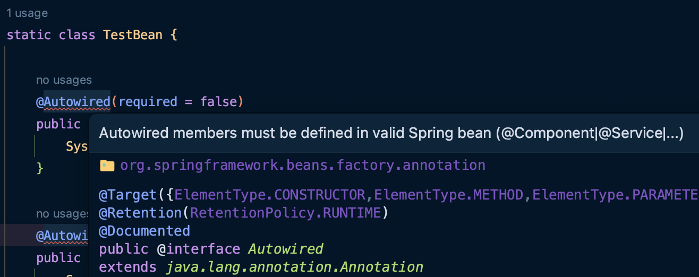

TOC
- [다양한 의존관계 주입 방법](#다양한-의존관계-주입-방법)
  - [생성자 주입](#생성자-주입)
  - [Setter 주입](#setter-주입)
  - [필드 주입](#필드-주입)
  - [일반 메소드 주입](#일반-메소드-주입)
- [옵션 처리](#옵션-처리)
- [생성자 주입을 선택해라!](#생성자-주입을-선택해라)
  - [불변](#불변)
  - [누락](#누락)
  - [final 키워드](#final-키워드)
  - [정리](#정리)
- [롬복과 최신 트렌드](#롬복과-최신-트렌드)
- [조회 빈이 2개 이상 - 문제](#조회-빈이-2개-이상---문제)
- [@Autowired 필드 명, @Qualifier, @Primary](#autowired-필드-명-qualifier-primary)
  - [@Autowired 필드 명 매칭](#autowired-필드-명-매칭)
  - [@Qualifier 사용](#qualifier-사용)
  - [@Primary 사용](#primary-사용)
- [어노테이션 직접 만들기](#어노테이션-직접-만들기)
- [조회한 빈이 모두 필요할 떄, List, Map](#조회한-빈이-모두-필요할-떄-list-map)
- [자동, 수동의 올바른 실무 운영 기준](#자동-수동의-올바른-실무-운영-기준)
  - [편리한 자동 기능을 기본으로 사용하자!](#편리한-자동-기능을-기본으로-사용하자)
  - [그러면 수동 빈 등록은 언제 사용하면 좋을까?](#그러면-수동-빈-등록은-언제-사용하면-좋을까)
  - [비즈니스 로직 중에서 다형성을 적극 활용할 때](#비즈니스-로직-중에서-다형성을-적극-활용할-때)

# 다양한 의존관계 주입 방법
- 생성자 주입
- Setter 주입
- 필드 주입
- 일반 메소드 주입

## 생성자 주입
생성자를 통해 의존관계를 주입!
- 생성자 호출 시점에 **딱 1번만 호출되는 것이 보장**된다.
- **불변, 필수** 의존관계에 사용된다.
- 빈 등록(생성자 호출) 시에, 의존 관계 주입까지 수행한다.
  - 인자로 필요한 객체들이 아직 생성되지 않았다면, 생성한 후 주입한다.

```java
@Autowired
public OrderServiceImpl(MemberRepository memberRepository, DiscountPolicy
discountPolicy) {
    this.memberRepository = memberRepository;
    this.discountPolicy = discountPolicy;
}
```
> 생성자가 딱 1개 있는 경우, `@Autowired` 를 생략 가능하다. (스프링 빈만 해당) 2개 이상인 경우, 컨테이너가 호출해야 할 생성자를 알 수 없기에 생략이 불가능하다.

## Setter 주입
필드 값을 변경하는 Setter를 통해 의존관계를 주입!
- **선택, 변경** 가능성이 있는 의존관계에 사용한다.
- 자바 빈 프로퍼티 규약의 Setter 메소드 방식을 사용하는 방법이다.

> **자바 빈**: 자바로 작성된 소프트웨어 컴포넌트를 지칭하는 단어
> **자바 빈즈 프로퍼티**
> 1. 기본 생성자가 반드시 존재해야 한다. (인자가 없는 디폴트 생성자)
> 2. 속성을 접근하고 꺼내올 수 있는 Getter & Setter 를 구성한다. 그리고 이를 통해서만 필드 값에 접근한다.
> 3. 속성을 지정(private)해야하는데 속성 이름은 보통 html의 form 태그안에서 input 태그의 name속성 값과 같게 정한다.

```java
@Autowired
public void setMemberRepository(MemberRepository memberRepository) {
    this.memberRepository = memberRepository;
}
@Autowired
public void setDiscountPolicy(DiscountPolicy discountPolicy) {
    this.discountPolicy = discountPolicy;
}
```

> `@Autowired` 의 기본 동작은 주입할 대상이 없으면 오류가 발생한다. 주입할 대상이 없어도 동작하게 하려면 `required = false` 로 지정한다. (혹은, 선택적으로 주입하기 위해서도 해당 속성을 사용한다.)

## 필드 주입
필드에 바로 주입!
- 외부에서 변경이 불가능해, 테스트가 어렵다는 단점이 있다. -> 안티 패턴
- DI 프레임워크가 없으면 아무것도 할 수 없다.
  - **순수한 자바 코드로는 의존관계 주입이 일어나지 않아서 테스트가 수행되지 않는다.** -> 스프링 컨테이너나, Setter가 필요해진다.
- **쓰지 마!!!**
  - 애플리케이션의 프로덕션 코드와 관계없는 테스트 코드,
  - 스프링 설정을 목적으로 하는 `@Configuration` 같은 곳에서만 특별한 용도로 사용하자.

```java
@Autowired
private MemberRepository memberRepository;
@Autowired
private DiscountPolicy discountPolicy;
```

> 순수한 자바 테스트 코드에서는 `@Autowired` 가 동작하지 않고, `@SpringBootTest` 처럼 스프링 컨테이너를 통합한 경우에만 사용 가능하다. 스프링 빈에 대해서만 스프링 컨테이너가 의존관계 자동 주입을 수행해주기 때문이다.

## 일반 메소드 주입
일반 메소드를 통해 주입!
- 한 번에 여러 필드를 주입받을 수 있다.
- 잘 사용하지 않는다.

---

# 옵션 처리
주입할 스프링 빈이 없어도 동작해야 할 때가 있다. 하지만 `@Autowired` 만 사용하면 `required` 옵션의 기본 값이 `true` 여서 자동 주입 대상이 없으면 오류가 발생한다.

자동 주입 대상을 옵션으로 처리하는 방법
- `@Autowired(required = false)` : 자동 주입할 대상이 없으면 수정자 메소드 자체가 호출되지 않음
- `org.springframework.lang.@Nullable` : 자동 주입할 대상이 없으면 `null` 이 입력된다.
- `Optional<>` : 자동 주입할 대상이 없으면 `Optional.empty` 가 입력된다.
  - 자바 8의 기능!

```java
public class AutowiredTest {
    @Test
    void autowiredOption() {
        ApplicationContext ac = new AnnotationConfigApplicationContext(TestBean.class);
    }

    static class TestBean {

        @Autowired(required = false)
        public void setNoBean1(Member member) {
            System.out.println("member = " + member);
        }

        @Autowired
        public void setNoBean2(@Nullable Member member) {
            System.out.println("member = " + member);
        }

        @Autowired
        public void setNoBean3(Optional<Member> member) {
            System.out.println("member = " + member);
        }
    }
}
```

- 여기서 `Member` 는 스프링 빈이 아니다.
  - `setNoBean1()` 은 `required` 속성으로 인해 주입할 빈이 없는 경우 호출되지 않는다.


- 위와 같은 오류가 발생하는데, 이는 코드 하이라이트 기능을 변경하면 없앨 수 있었다. 테스트 코드 동작에는 문제가 없는 오류이다.

> `@Nullable` , `Optional` 은 스프링 전반에 걸쳐서 지원된다. 예를 들어서 생성자 자동 주입에서 특정 필드에만 사용해도 된다.

---

# 생성자 주입을 선택해라!
최근 스프링을 포함한 대부분의 DI 프레임워크가 생성자 주입을 권장하는데, 이러한 이유가 뭘까?

## 불변
- 대부분의 의존관계 주입은 애플리케이션 종료 시점까지 변경될 일이 없다!
  - 오히려 불변해야 한다!
- setter를 `public` 으로 열어둬야 한다. 수정자 주입을 사용하면, 이를 통해 실수로 변경될 가능성이 발생한다.
  - 변경하면 안되는 메소드를 `public` 으로 열어두는 것은 좋은 설계 방법이 아니다.

**-> 생성자 주입은 객체 생성 시 1번만 호출되는 것이 보장되므로 불변하게 설계할 수 있다!**

## 누락
프레임워크 없이 순수한 자바 코드를 단위 테스트 하는 경우를 살펴보자.

**수정자 의존관계의 경우**
```java
public class OrderServiceImpl implements OrderService {
    private MemberRepository memberRepository;
    private DiscountPolicy discountPolicy;

    @Autowired
    public void setMemberRepository(MemberRepository memberRepository) {
        this.memberRepository = memberRepository;
    }

    @Autowired
    public void setDiscountPolicy(DiscountPolicy discountPolicy) {
        this.discountPolicy = discountPolicy;
    }

    //...
}
```

- `@Autowired` 가 프레임워크 안에서 동작할 때는 의존관계가 없으면 오류가 발생하지만, 지금은 프레임워크 없이 순수한 자바 코드로만 단위 테스트를 수행하고 있다.

```java
@Test
void createOrder() {
    OrderServiceImpl orderService = new OrderServiceImpl();
    orderService.createOrder(1L, "itemA", 10000);
}
```

- 위와 같이 테스트 코드를 작성하게 되면, 실행은 되지만 `NullPointerException` 이 발생한다.
  - 프레임워크가 해주던 **의존관계 주입을 수행하지 않기 때문이다!**
- **그렇다면 Setter를 호출해주면 되지 않나?**
  - 테스트를 작성하는 입장에서는 해당 빈이 필요한 의존관계를 알 수 없다. (코드를 까봐야 한다.)

**-> 생성자 주입을 사용하면, 당연히 생성자에 인자가 없으므로 컴파일 오류가 발생한다. 따라서, 누락이 발생하기에 생성자 주입을 사용해야 한다.**

## final 키워드
생성자 주입을 사용하면 해당 필드에 `final` 키워드를 사용할 수 있다.
- **따라서 생성자에서 혹시라도 값이 설정되지 않는 오류를 컴파일 시에 막아줄 수 있다.**
  - `java: variable xxx might not have been initialized`

> 생성자 주입만이 객체 생성 시에 호출되므로, `final` 키워드를 사용할 수 있다.

## 정리
- 생성자 주입 방식을 선택하는 이유는 여러 가지가 있지만, 프레임워크에 의존하지 않고, 순수한 자바 언어의 특징을 잘 살리는 방법이기도 하다.
- 기본으로 **생성자 주입**을 사용하고, 필수 값이 아닌 경우에는 **수정자 주입 방식**을 옵션으로 부여하면 된다. 필드 주입은 사용하지 않는게 좋다.

---

# 롬복과 최신 트렌드
실제 개발을 해보면, 대부분이 다 불변이고, 그래서 다음과 같이 생성자에 `final` 키워드를 사용하게 된다. 그런데 생성자도 만들고 주입 받은 값을 대입하는 코드도 만들고, 조금 과정이 귀찮은 듯하다.

필드 주입처럼 좀 편리하게 사용하는 방법은 없을까?

**기본 코드**
```java
@Component
public class OrderServiceImpl implements OrderService {
    private final MemberRepository memberRepository;
    private final DiscountPolicy discountPolicy;
    
    @Autowired
    public OrderServiceImpl(MemberRepository memberRepository, DiscountPolicy
discountPolicy) {
        this.memberRepository = memberRepository;
        this.discountPolicy = discountPolicy;
    }
}
```

- 생성자가 1개라면, `@Autowired` 를 생략할 수는 있다!
- **롬복**이라는 라이브러리로 이를 한 번 더 편리하게 변경해보자.
  - 롬복의 대표적인 기능은 어노테이션을 통해 **getter & setter 자동 생성, 생성자 관련 지원** 기능이 있다. (Gradle에서 의존성 추가할 때 보면, Annotation Processor와 관련된 설정이 있다 .. !!!)

```java
@RequiredArgsConstructor
@Component
public class OrderServiceImpl implements OrderService {

    private final MemberRepository memberRepository;
    private final DiscountPolicy discountPolicy;
​
    @Override
    public Order createOrder(Long memberId, String itemName, int itemPrice) {
        Member member = memberRepository.findById(memberId);

        int discountPrice = discountPolicy.discount(member, itemPrice);
​
        return new Order(memberId, itemName, itemPrice, discountPrice);
    }
}
```

- 롬복이 자바의 **Annotation Processor**라는 기능을 이용해 컴파일 시점에 생성자 코드를 자동으로 생성해준다.
- `@RequiredArgsConstructor` : `final` 이 붙거나 `@NotNull` 이 붙은 필드의 생성자를 자동 생성해주는 롬복 어노테이션

---

# 조회 빈이 2개 이상 - 문제
`@Autowired` 는 타입으로 조회한다.
- 따라서 다음 코드와 유사하게 동작한다. (실제로는 더 많은 기능을 제공!)
  - `ac.getBean(DiscountPolicy.class)`

[스프링 빈 조회](https://github.com/SeongukBaek/DevDevDev/blob/main/Spring/%EC%8A%A4%ED%94%84%EB%A7%81%20%ED%95%B5%EC%8B%AC%20%EC%9B%90%EB%A6%AC%20-%20%EA%B8%B0%EB%B3%B8%ED%8E%B8/%EC%84%B9%EC%85%984/%EC%84%B9%EC%85%984.%20%EC%8A%A4%ED%94%84%EB%A7%81%20%EC%BB%A8%ED%85%8C%EC%9D%B4%EB%84%88%EC%99%80%20%EC%8A%A4%ED%94%84%EB%A7%81%20%EB%B9%88.md#%EC%8A%A4%ED%94%84%EB%A7%81-%EB%B9%88-%EC%A1%B0%ED%9A%8C---%EB%8F%99%EC%9D%BC%ED%95%9C-%ED%83%80%EC%9E%85%EC%9D%B4-%EB%91%98-%EC%9D%B4%EC%83%81)에서 배웠듯, 타입으로 조회 시 선택된 빈이 2개 이상이면 문제가 발생한다.
- `NoUniqueBeanDefinitionException` 예외 발생
- 이를 해결하기 위해, 하위 타입으로 지정하여 특정 빈만을 조회할 수는 있지만 이는 DIP를 위배하고 유연성을 떨어뜨리는 행위다.
- 또한 이름만 다르고, 완전히 동일한 타입의 스프링 빈이 2개 있을 때 해결되지 않는다.

> 스프링 빈을 수동 등록하여 문제를 해결할 수도 있지만, 의존관계 자동 주입에서 해결하는 여러 방법도 있다. 이는 아래에서 다룬다.

---

# @Autowired 필드 명, @Qualifier, @Primary
위에서 다룬 조회 대상 빈이 2개 이상일 때의 해결방법을 하나씩 알아본다.
- `@Autowired` 필드 명 매칭
- `@Qualifier` -> `@Qualifier` 끼리 매칭 -> 빈 이름 매칭
- `@Primary` 사용

## @Autowired 필드 명 매칭
`@Autowired` 는 타입 매칭을 시도하고, 이때 여러 빈이 있으면 **필드 이름(파라미터 이름)**으로 빈 이름을 추가 매칭한다.

**기존 코드(필드 주입)**
```java
@Autowired
private final DiscountPolicy discountPolicy;
```

**필드 명을 빈 이름으로 변경**
```java
@Autowired
private final DiscountPolicy rateDiscountPolicy;
```

- 필드 명이 `rateDiscountPolicy` 이므로, `DiscountPolicy` 타입인 2개의 빈 중, `rateDiscountPolicy` 라는 이름을 가진 빈으로 정상 주입된다.

## @Qualifier 사용
추가 구분자를 붙여주는 방법이다. 주입 시 추가적인 방법을 제공하는 것이지, 빈 이름을 변경하는 것은 아니다.

**빈 등록 시**
```java
@Component
// 해당 빈에 대한 구분자를 등록
@Qualifier("mainDiscountPolicy") 
public class RateDiscountPolicy implements DiscountPolicy {
    ...
}
```

**주입 시**
```java
@Autowired
public OrderServiceImpl(MemberRepository memberRepository,
                        @Qualifier("mainDiscountPolicy") DiscountPolicy
discountPolicy) {
    this.memberRepository = memberRepository;
    this.discountPolicy = discountPolicy;
}
```

`@Qualifier` 로 주입할 때, `@Qualifier("mainDiscountPolicy")` 를 못 찾으면 어떻게 될까?
- 그러면 `mainDiscountPolicy` 라는 이름의 스프링 빈을 추가로 찾는다.
- 하지만 `@Qualifier` 는 `@Qualifier` 를 찾는 용도로만 사용하는 것이 좋다! (like. 쌍쌍바)

또한 필드 주입이나, 빈 수동 등록 시에도 `@Qualifier` 를 동일하게 사용할 수 있다.
```java
@Bean
@Qualifier("mainDiscountPolicy")
public DiscountPolicy discountPolicy() {
    ...
}
```

## @Primary 사용
이는 우선순위를 정하는 방법이다. 여러 빈이 매칭되면 `@Primary` 가 우선권을 가진다.

```java
@Component
@Primary
public class RateDiscountPolicy implements DiscountPolicy {}
​
@Component 
public class FixDiscountPolicy implements DiscountPolicy {}
```
- 위 경우는 `RateDiscountPolicy` 가 우선권을 가진다!
- `@Qualifier` 의 단점은 주입 받을 때 모든 코드에 `@Qualifier` 를 붙여줘야 한다는 점이다. 반면에 `@Primary` 를 사용하면 우선순위를 가질 클래스에만 이를 붙여주면 된다.

**@Primary와 @Qualifier의 우선순위**
- `@Primary` 는 기본값처럼 동작하고, `@Qualifier` 는 매우 상세하게 동작한다.
- 스프링은 **자동보다는 수동**이, **넓은 범위의 선택권보다는 좁은 범위의 선택권**이 **우선 순위가 높다.**
  - **즉, `@Qualifier` 의 우선순위가 더 높다.**

---

# 어노테이션 직접 만들기
`@Qualifier("mainDiscountPolicy")` 이렇게 문자를 적으면 컴파일시 타입 체크가 안된다.
- 이는 어노테이션을 통해 깔끔하게 체크할 수 있다!

```java
@Target({ElementType.FIELD, ElementType.METHOD, ElementType.PARAMETER, ElementType.TYPE, ElementType.ANNOTATION_TYPE})
@Retention(RetentionPolicy.RUNTIME)
@Inherited
@Documented
@Qualifier("mainDiscountPolicy")
public @interface MainDiscountPolicy {
    String value() default "";
}
```

- Target : 해당 어노테이션이 어떤 종류의 요소에 적용될 수 있는지 정의
- Retention : 어노테이션에 대한 유효기간 정의
  - SOURCE : 어노테이션이 소스 코드에만 유지되고, 컴파일된 바이트코드나 런타임에는 포함되지 않는다.
- Inherited : 자식 클래스에서 부모 클래스에 선언된 어노테이션을 상속받을 수 있음을 의미
- Documented : javadoc 및 기타 문서툴에 의해 문서화될 때, 해당 어노테이션이 문서에 표시됨

이제 만든 어노테이션을 빈으로 등록할 클래스와 이를 사용하는 클래스에 적용시켜주자.

```java
@Component
@MainDiscountPolicy
public class RateDiscountPolicy implements DiscountPolicy {
    private final int discountPercent = 10;

    @Override
    public int discount(Member member, int price) {
        if (member.getGrade() == Grade.VIP) {
            return price * discountPercent / 100;
        }
        return 0;
    }
}
```

```java
@Component
public class OrderServiceImpl implements OrderService {
    private final MemberRepository memberRepository;
    private final DiscountPolicy discountPolicy;

    @Autowired
    public OrderServiceImpl(MemberRepository memberRepository, @MainDiscountPolicy DiscountPolicy discountPolicy) {
        this.memberRepository = memberRepository;
        this.discountPolicy = discountPolicy;
    }
    ...

}
```

**어노테이션에는 상속이라는 개념이 없다.** 
- 이렇게 어노테이션을 모아서 사용하는 기능은 **스프링이 지원해주는 기능**이다.

---

# 조회한 빈이 모두 필요할 떄, List, Map
의도적으로 **해당 타입의 모든 스프링 빈이 필요한 경우**가 있다.
- 할인 서비스를 제공하는데, 클라이언트가 **할인의 종류(fix, rate)를 선택할 수 있는 경우**가 있을 수 있다.

```java
public class AllBeanTest {

    @Test
    void findAllBean() {
        ApplicationContext applicationContext = new AnnotationConfigApplicationContext(DiscountService.class);
    }

    static class DiscountService {
        private final Map<String, DiscountPolicy> policyMap;
        private final List<DiscountPolicy> policyList;

        public DiscountService(Map<String, DiscountPolicy> policyMap, List<DiscountPolicy> policyList) {
            this.policyMap = policyMap;
            this.policyList = policyList;

            System.out.println("policyMap = " + policyMap);
            System.out.println("policyList = " + policyList);
        }
    }
}
```

- `DiscountService` 라는 클래스를 설정 파일로 가지는 `ApplicationContext` 를 만든다.
- 현재 위 코드에서는 출력문에 아무 것도 없다. 당연히 `DiscountService` 만 빈으로 등록되어 있기 때문이다.

```java
@Test
void findAllBean() {
    ApplicationContext applicationContext = new AnnotationConfigApplicationContext(AutoAppConfig.class, DiscountService.class);

}
```
```java
policyMap = {fixDiscountPolicy=hello.core.discount.FixDiscountPolicy@52de51b6, rateDiscountPolicy=hello.core.discount.RateDiscountPolicy@18c5069b}
policyList = [hello.core.discount.FixDiscountPolicy@52de51b6, hello.core.discount.RateDiscountPolicy@18c5069b]
```

- 위와 같이 앞서 생성했던 `AutoAppConfig` 또한 설정 파일로 전달하게 되면, 등록한 모든 빈을 맵, 리스트 형태로 출력하게 된다. 

```java
public class AllBeanTest {

    @Test
    void findAllBean() {
        ApplicationContext applicationContext = new AnnotationConfigApplicationContext(AutoAppConfig.class, DiscountService.class);

        DiscountService discountService = applicationContext.getBean(DiscountService.class);
        Member member = new Member(1L, "userA", Grade.VIP);
        int discountPrice = discountService.discount(member, 10000, "fixDiscountPolicy");

        assertInstanceOf(DiscountService.class, discountService);
        assertEquals(discountPrice, 1000);

        int rateDiscountPrice = discountService.discount(member, 20000, "rateDiscountPolicy");

        assertInstanceOf(DiscountService.class, discountService);
        assertEquals(rateDiscountPrice, 2000);
    }

    static class DiscountService {
        private final Map<String, DiscountPolicy> policyMap;
        private final List<DiscountPolicy> policyList;

        public DiscountService(Map<String, DiscountPolicy> policyMap, List<DiscountPolicy> policyList) {
            this.policyMap = policyMap;
            this.policyList = policyList;

            System.out.println("policyMap = " + policyMap);
            System.out.println("policyList = " + policyList);
        }

        public int discount(Member member, int price, String discountCode) {
            DiscountPolicy discountPolicy = policyMap.get(discountCode);
            return discountPolicy.discount(member, price);
        }
    }
}
```

- **로직 분석**
  - `DiscountService` 는 `Map` 으로 만든 `DiscountPolicy` 를 주입 받는다. 이때 `fixDiscountPolicy` , `rateDiscountPolicy` 가 주입된다.
  - `discount()` : 인자로 받은 할인 정책 코드에 따라, 조회한 빈 맵에서 해당되는 빈을 가져와, 할인을 적용한다.
- **주입 분석**
  - `Map<String, DiscountPolicy>` : `map` 의 키에 스프링 빈의 이름을 넣어주고, 그 값으로 `DiscountPolicy` 타입으로 조회한 모든 스프링 빈을 담는다.
  - `List<DiscountPolicy>` : `DiscountPolicy` 타입으로 조회한 모든 스프링 빈을 담아준다.
  - 만약 해당하는 타입의 빈이 없다면, 빈 컬렉션이나 `Map` 을 주입한다.

---

#  자동, 수동의 올바른 실무 운영 기준
## 편리한 자동 기능을 기본으로 사용하자!

어떤 경우에 컴포넌트 스캔과 자동 주입을 사용하고, 어떤 경우에 설정 정보를 통해 수동으로 빈을 등록하고 의존관계도 수동으로 주입해야 할까?

결론부터 이야기하면, 스프링이 나오고 시간이 갈수록 점점 **자동을 선호하는 추세**다. 스프링은 `@Component` 뿐만 아니라 `@Controller` , `@Service` , `@Repository` 처럼 계층에 맞추어 일반적인 애플리케이션 로직을 자동으로 스캔할 수 있도록 지원한다. 거기에 더해서 최근 스프링 부트는 **컴포넌트 스캔을 기본으로 사용**하고, 스프링 부트의 다양한 스프링 빈들도 조건이 맞으면 자동으로 등록하도록 설계했다.

설정 정보를 기반으로 애플리케이션을 구성하는 부분과 실제 동작하는 부분을 명확하게 나누는 것이 이상적이지만, 개발자 입장에서 스프링 빈을 하나 등록할 때 `@Component` 만 넣어주면 끝나는 일을
1.  `@Configuration` 설정 정보에 가서 `@Bean` 을 적고, 
2.  객체를 생성하고, 
3.  주입할 대상을 일일이 적어주는

과정은 상당히 번거롭다.

또 관리할 빈이 많아서 설정 정보가 커지면 설정 정보를 관리하는 것 자체가 부담이 된다. 그리고 결정적으로 **자동 빈 등록을 사용해도 OCP, DIP를 지킬 수 있다.**
- `@Component` , `@Primary` 등을 사용하면, 새로운 클래스가 추가된다해도 대응 가능하다.

## 그러면 수동 빈 등록은 언제 사용하면 좋을까?

애플리케이션은 크게 업무 로직과 기술 지원 로직으로 나눌 수 있다.
- **업무 로직 빈**: 웹을 지원하는 컨트롤러, 핵심 비즈니스 로직이 있는 서비스, 데이터 계층의 로직을 처리하는 리포지토리 등이 해당된다. 
  - 보통 비즈니스 요구사항을 개발할 때 추가되거나 변경된다.
- **기술 지원 빈**: 기술적인 문제나 공통 관심사(AOP)를 처리할 때 주로 사용된다. 데이터베이스 연결이나, 공통 로그 처리처럼 업무 로직을 지원하기 위한 하부 기술이나 공통 기술들이다.

업무 로직은 숫자도 매우 많고, 한번 개발해야 하면 컨트롤러, 서비스, 리포지토리처럼 **어느 정도 유사한 패턴이 있다.** 
-> **이런 경우 자동 기능을 적극 사용하는 것이 좋다.** 보통 문제가 발생해도 어떤 곳에서 문제가 발생했는지 명확하게 파악하기 쉽다.

기술 지원 로직은 업무 로직과 비교해서 그 수가 매우 적고, **보통 애플리케이션 전반에 걸쳐서 광범위하게 영향을 미친다.** 그리고 업무 로직은 문제가 발생했을 때 어디가 문제인지 명확하게 잘 드러나지만, 기술 지원 로직은 적용이 잘 되고 있는지 아닌지조차 파악하기 어려운 경우가 많다. 
-> 그래서 이런 기술 지원 로직들은 **가급적 수동 빈 등록을 사용해서 명확하게 드러내는 것이 좋다.**

> 애플리케이션에 광범위하게 영향을 미치는 기술 지원 객체는 수동 빈으로 등록해서 딱! 설정 정보에 바로 나타나게 하는 것이 유지보수하기 좋다.

그렇다면 어떤 경우 수동 빈으로 등록할 수 있을까?

## 비즈니스 로직 중에서 다형성을 적극 활용할 때
- 의존관계 자동 주입 - 조회한 빈이 모두 필요할 때, `List` , `Map` 을 다시 보자.
- `DiscountService` 가 의존관계 자동 주입으로 `Map<String, DiscountPolicy>` 에 주입을 받는 상황을 생각해보자. **여기에 어떤 빈들이 주입될지, 각 빈들의 이름은 무엇일지 코드만 보고 한번에 쉽게 파악할 수 있을까?** 내가 개발했으니 크게 관계가 없지만, 만약 이 코드를 다른 개발자가 개발해서 나에게 준 것이라면 어떨까?
  - 자동 등록을 사용하고 있기 때문에 파악하려면 여러 코드를 찾아봐야 한다.

-> 이런 경우 별도의 설정 정보를 만들고, 수동 빈으로 등록하거나 또는 자동으로 하면 특정 패키지에 같이 묶어두는게 좋다! **핵심은 딱 보고 이해가 되어야 한다!**

> **스프링과 스프링 부트가 자동으로 등록하는 수 많은 빈들은 예외다.** 이런 부분들은 스프링 자체를 잘 이해하고 스프링의 의도대로 잘 사용하는게 중요하다. 스프링 부트의 경우 `DataSource` 같은 데이터베이스 연결에 사용하는 기술 지원 로직까지 내부에서 자동으로 등록하는데, 이런 부분은 메뉴얼을 잘 참고해서 스프링 부트가 의도한 대로 편리하게 사용하면 된다. 반면에 스프링 부트가 아니라 내가 직접 기술 지원 객체를 스프링 빈으로 등록한다면 수동으로 등록해서 명확하게 드러내는 것이 좋다.