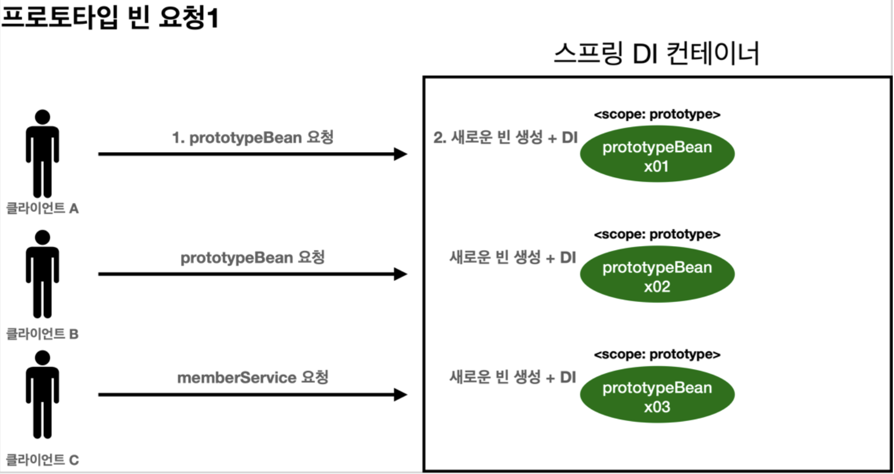
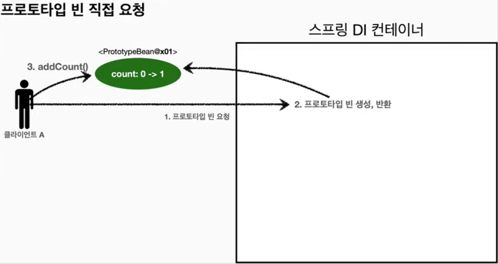
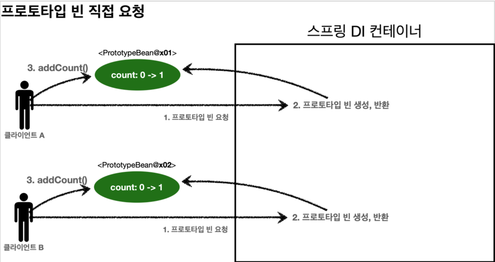
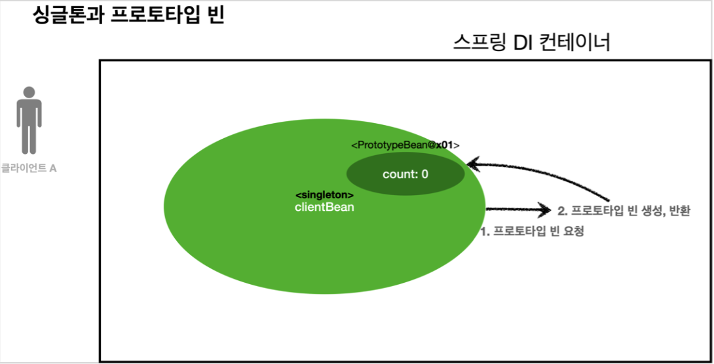
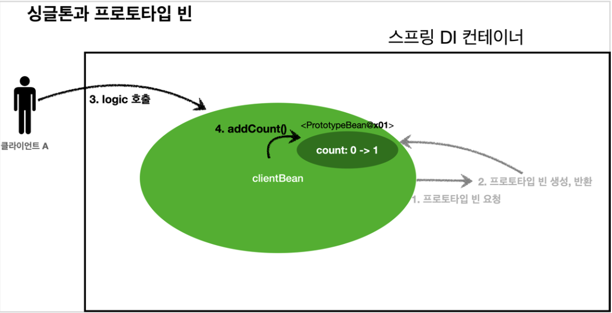
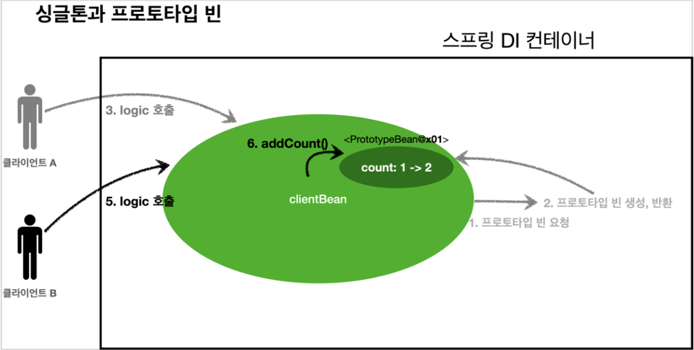
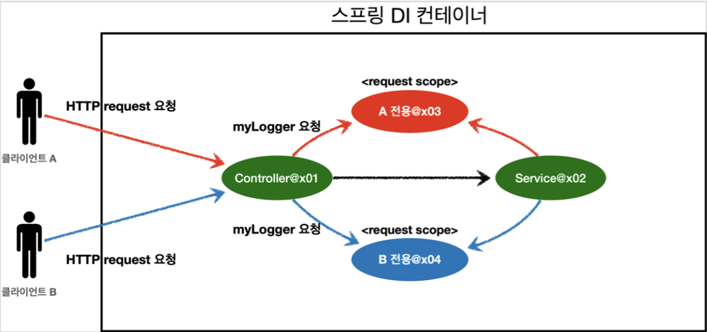
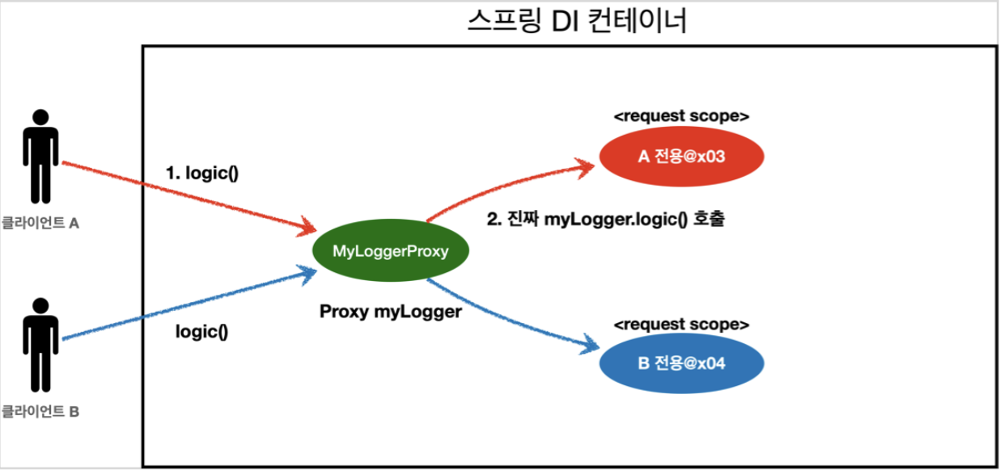

TOC
- [빈 스코프란?](#빈-스코프란)
- [프로토타입 스코프](#프로토타입-스코프)
- [프로토타입 스코프 - 싱글톤 빈과 함께 사용 시 문제점](#프로토타입-스코프---싱글톤-빈과-함께-사용-시-문제점)
  - [프로토타입 빈 직접 요청](#프로토타입-빈-직접-요청)
  - [싱글톤 빈에서 프로토타입 빈 사용](#싱글톤-빈에서-프로토타입-빈-사용)
- [프로토타입 스코프 - 싱글톤 빈과 함께 사용 시 Provider로 문제 해결](#프로토타입-스코프---싱글톤-빈과-함께-사용-시-provider로-문제-해결)
  - [스프링 컨테이너에 요청](#스프링-컨테이너에-요청)
  - [ObjectFactory, ObjectProvider](#objectfactory-objectprovider)
  - [JSR-330 Provider](#jsr-330-provider)
  - [정리](#정리)
- [웹 스코프](#웹-스코프)
- [request 스코프 예제 만들기](#request-스코프-예제-만들기)
  - [웹 환경 추가](#웹-환경-추가)
  - [request 스코프 예제 개발](#request-스코프-예제-개발)
- [스코프와 Provider](#스코프와-provider)
- [스코프와 프록시](#스코프와-프록시)
  - [웹 스코프와 프록시 동작 원리](#웹-스코프와-프록시-동작-원리)

# 빈 스코프란?
> 빈 스코프: 빈이 존재할 수 있는 범위

스프링 빈은 기본적으로 싱글톤 스코프로 생성된다.
- 따라서 스프링 컨테이너가 종료될 때까지 유지

스프링은 아래와 같은 스코프를 지원
- **싱글톤**: 기본 스코프, 스프링 컨테이너의 시작과 종료까지 유지되는 가장 넓은 범위의 스코프
- **프로토타입**: 스프링 컨테이너는 프로토타입 빈의 생성과 의존관계 주입까지만 관여하고 더는 관리하지 않는 매우 짧은 범위의 스코프
  - 종료 메소드 호출이 불가능!
- **웹 관련 스코프**: 스프링 웹과 관련된 기능이 들어가야 사용할 수 있는 스코프
  - **request**: 웹 요청이 들어오고 나갈때 까지 유지되는 스코프
  - **session**: 웹 세션이 생성되고 종료될 때 까지 유지되는 스코프 -> 로그인에서 많이 사용
  - **application**: 웹의 서블릿 컨텍스트와 같은 범위로 유지되는 스코프

**빈 스코프 지정 방법**
- `@Scope("prototype")` 사용

---

# 프로토타입 스코프
프로토타입 스코프를 스프링 컨테이너에 조회하면 스프링 컨테이너는 **항상 새로운 인스턴스를 생성, 의존관계 주입, 초기화해서 반환**


- **요청 시**(`ac.getBean()`)에 프로토타입 빈을 생성하고, 의존관계를 주입, 초기화
- 생성한 빈을 반환

=> 따라서 매번 다른 빈을 반환받게 된다!

> 프로타타입 빈을 관리할 책임은 프로토타입 빈을 받은 클라이언트에 있기에, 스프링 컨테이너가 종료될때, `@PreDestroy` 같은 종료 메소드가 호출되지 않는다.

---

# 프로토타입 스코프 - 싱글톤 빈과 함께 사용 시 문제점
싱글톤 빈과 함께 사용하는 경우, 프로토타입 스코프의 빈이어도 항상 새로운 객체 인스턴스를 생성해서 반환하지 않을 수도 있다.

## 프로토타입 빈 직접 요청

- 프로토타입 빈을 요청해서, 새로 생성된 빈을 반환받았다.
- 그리고 그 빈의 `addCount()`를 호출해, 해당 빈의 `count` 필드 값을 변경했다.


- 다른 클라이언트가 동일한 빈을 요청해서, 새로 생성된 빈을 반환받았다.
- 위 클라이언트와 동일한 작업을 수행했다.

## 싱글톤 빈에서 프로토타입 빈 사용
`clientBean` 이라는 싱글톤 빈이 의존관계 주입을 통해 프로토타입 빈을 주입받는 상황을 가정해보자.


- `clientBean` 은 컨테이너 생성 시점에 이미 빈이 생성되었다.
- 그리고 이때, **의존 관계가 있는 프로토타입 빈을 생성해서 주입**받았다.
- 이후 `clientBean` 은 **프로토타입 빈의 참조값**을 내부 필드로서 관리한다.


- 클라이언트 A가 `clientBean` 을 요청해 컨테이너로부터 받는다.
- 이후 A가 `clientBean.logic()`을 호출하고, 해당 로직은 prototypeBean의 `addCount()`를 호출한다.
  - 이제 `prototypeBean` 의 `count` 는 1이다.


- 클라이언트 B가 A와 동일한 로직을 수행하고, 결과적으로 `prototypeBean` 의 `count` 는 2이다.

> 중요한 점은, `prototypeBean` 은 여기서 실제로 프로토타입 스코프를 가지고 있지 않다는 것이다.
> - 이미 과거에 주입이 끝났고, 사용할 때마다 새로 생성이 되는 것이 아니다!!!

스프링은 싱글톤 빈을 일반적으로 사용하기에, 싱글톤 빈이 프로토타입 빈을 사용하게 될 것이다. 프로토타입 빈은 싱글톤 빈과 함께 유지되어, 사용할 때마다 새로 생성되지는 않을 것이다.

---

# 프로토타입 스코프 - 싱글톤 빈과 함께 사용 시 Provider로 문제 해결
그럼 어떻게 하면 싱글톤 빈과 함께 사용하면서 프로토타입 빈을 매 요청마다 새로 생성해서 사용할 수 있을까?

## 스프링 컨테이너에 요청
가장 간단한 방법은 싱글톤 빈이 프로토타입을 사용할 때마다, 컨테이너에 새로 요청하는 방식이다.

```java
public int logic() {
  PrototypeBean prototypeBean = ac.getBean(PrototypeBean.class);
  prototypeBean.addCount();
  int count = prototypeBean.getCount();
  return count;
}
```

- 위와 같이 의존 관계를 외부에서 주입받는 게 아닌, 직접 찾는 것을 **의존 관계 탐색(조회), Dependency Lookup(DL)** 이라 한다.
- 이러한 코드는 스프링 컨테이너에 종속적인 코드가 되고, 단위 테스트 또한 어렵게 한다.

=> 즉, 이 방법은 우리가 필요로 하는, "지정한 프로토타입 빈을 컨테이너에서 대신 찾아주는 정도의 기능"만 제공하지는 않고 있다.

## ObjectFactory, ObjectProvider
우리가 필요로 하는 DL 서비스를 제공하는 것이 `ObjectProvider` 이다.
- 기존의 `ObjectFactory` 를 상속하고, 옵션, 스트림 처리 등의 편의 기능이 추가되고, 별도의 라이브러리가 필요하지 않은 클래스

```java
@Autowired
private ObjectProvider<PrototypeBean> prototypeBeanProvider;

public int logic() {
    PrototypeBean prototypeBean = prototypeBeanProvider.getObject();
    prototypeBean.addCount();
    int count = prototypeBean.getCount();
    return count;
}
```

- `getObject()`를 호출하면, 컨테이너로부터 제네릭으로 전달된 `PrototypeBean` 타입의 빈을 요청한다.
- 딱 필요한 **DL** 정도의 기능만을 제공한다.

> 하지만 이 방식은 **스프링에 의존**한다는 문제점이 있다.

## JSR-330 Provider
마지막 방법은 `javax.inject.Provider` 라는 JSR-330 **자바 표준**을 사용하는 방법이다.
- 말 그대로 자바 표준을 사용하기에, 위에서의 문제점이었던 스프링에 대한 의존성을 없앨 수 있다.
- 라이브러리 추가는 필요하다!

```java
// implementation 'javax.inject:javax.inject:1' gradle 추가 필수

@Autowired 
private Provider<PrototypeBean> provider;

public int logic() {
      PrototypeBean prototypeBean = provider.get();
      prototypeBean.addCount();
      int count = prototypeBean.getCount();
      return count;
}
```

> 지연 로딩이나, 순환 참조 시에 이를 활용할 수 있다!!!

## 정리
- 실무에서는 싱글톤 빈으로 대부분의 문제를 해결하기에, 프로토타입 빈을 사용하는 경우는 드물다.

---

# 웹 스코프
**웹 스코프의 특징**
- 웹 환경에서만 동작
- 스프링이 해당 스코프의 종료 시점까지 관리한다. 따라서 종료 메소드가 호출된다. (프로토타입은 그렇지 않았다.)

**웹 스코프 종류**
- **request**: **HTTP 요청 하나**가 들어오고 나갈 때까지 유지되는 스코프, 각각의 HTTP 요청마다 별도의 빈 인스턴스가 생성되고, 관리된다.
- **session**: HTTP Session과 동일한 생명주기를 가지는 스코프
- **application**: 서블릿 컨텍스트( `ServletContext` )와 동일한 생명주기를 가지는 스코프
- **websocket**: 웹 소켓과 동일한 생명주기를 가지는 스코프

**HTTP request 요청당 각각 할당되는 request 웹 스코프**


---

# request 스코프 예제 만들기
## 웹 환경 추가
웹 스코프는 웹 환경에서만 동작하기에 라이브러리가 필요하다.

```gradle
implementation 'org.springframework.boot:spring-boot-starter-web'
```

> `spring-boot-starter-web` 라이브러리를 추가하면 스프링 부트는 내장 톰켓 서버를 활용해서 웹 서버와 스프링을 함께 실행시킨다.

> 스프링 부트는 웹 라이브러리가 없으면 우리가 지금까지 학습한 `AnnotationConfigApplicationContext` 을 기반으로 애플리케이션을 구동한다. 웹 라이브러리가 추가되면 웹과 관련된 추가 설정과 환경들이 필요하므로 `AnnotationConfigServletWebServerApplicationContext` 를 기반으로 애플리케이션을 구동한다.

## request 스코프 예제 개발
동시에 여러 HTTP 요청이 들어오면 어떤 요청이 남긴 로그인지 구분이 어렵다.
- 이때 request 스코프가 적용하기 안성맞춤이다!
- 기대하는 공통 포멧: `[UUID][requestURL] {message}`

**MyLogger**
```java
@Component
@Scope(value = "request")
public class MyLogger {
    private String uuid;
    private String requestURL;

    public void setRequestURL(String requestURL) {
        this.requestURL = requestURL;
    }

    public void log(String message) {
        System.out.println("[" + uuid + "]" + "[" + requestURL + "] " + message);
    }

    @PostConstruct
    public void init() {
        uuid = UUID.randomUUID().toString();
        System.out.println("[" + uuid + "] request scope bean create: " + this);
    }

    @PreDestroy
    public void close() {
        System.out.println("[" + uuid + "] request scope bean close: " + this);
    }
}
```

- 이 빈은 HTTP 요청 당 하나씩 생성되고, HTTP 요청이 끝나는 시점에 소멸
- uuid는 고유한 값이므로 빈 생성 시 이를 저장해두면 다른 HTTP 요청과 구분할 수 있다.

```java
@Controller
@RequiredArgsConstructor
public class LogDemoController {
    private final LogDemoService logDemoService;
    private final MyLogger myLogger;

    @RequestMapping("log-demo")
    @ResponseBody
    public String logDemo(HttpServletRequest request) {
        String requestURL = request.getRequestURL().toString();
        myLogger.setRequestURL(requestURL);

        myLogger.log("controller test");

        logDemoService.logic("testID");
        return "hi";
    }
}

@Service
@RequiredArgsConstructor
public class LogDemoService {
    private final MyLogger myLogger;

    public void logic(String id) {
        myLogger.log("service id = " + id);
    }
}
```

> `requestURL` 을 `MyLogger` 에 저장하는 부분은 컨트롤러보다는 공통 처리가 가능한 스프링 인터셉터나 서블릿 필터를 활용하는 것이 좋다.

- 정상적으로 동작해야 하는 코드가, 실행 오류를 일으킨다.
- 스프링 애플리케이션을 실행하는 시점에 싱글톤 빈은 생성해서 주입이 가능하지만, request 스코프 빈은 아직 생성되지 않는다. 이 빈은 실제 고객의 요청이 와야 생성할 수 있기 때문이다.
  - 애플리케이션이 실행될 때, 고객의 요청이 바로 오지 않기 때문 ... !

---

# 스코프와 Provider
위 문제를 해결하는 첫번째 방법은 이전에 다룬 `Provider` 를 활용하는 것이다.

```java
@Controller
@RequiredArgsConstructor
public class LogDemoController {
    private final LogDemoService logDemoService;
    private final ObjectProvider<MyLogger> myLoggerProvider;

    @RequestMapping("log-demo")
    @ResponseBody
    public String logDemo(HttpServletRequest request) {
        String requestURL = request.getRequestURL().toString();
        MyLogger myLogger = myLoggerProvider.getObject();
        myLogger.setRequestURL(requestURL);

        myLogger.log("controller test");

        logDemoService.logic("testID");
        return "hi";
    }
}
```

- 위와 같이 Provider를 사용해서, 실제로 사용하기 전까지 request scope 빈의 생성을 미룰 수 있다.
- Controller와 Service에서 따로 MyLogger를 호출해도, 같은 HTTP 요청이기에 하나의 MyLogger가 사용된다!

---

# 스코프와 프록시

```java
@Component
@Scope(value = "request", proxyMode = ScopedProxyMode.TARGET_CLASS)
public class MyLogger { ... }
```

- `proxyMode` 설정을 추가한다.
- 이를 통해 해당 클래스의 프록시 클래스를 만들어두고, HTTP request와 상관 없이 프록시 클래스를 다른 빈에 미리 주입해둘 수 있다.
  - 이제 기존 코드를 `Provider` 를 사용하기 전으로 돌리자.

## 웹 스코프와 프록시 동작 원리
- `myLogger.getClass()` 를 확인해보면, 아래와 같이 **CGLIB**라는 단어가 보인다.
  - 해당 라이브러리로 클래스를 상속받은 프록시 객체를 만들어서 주입하는데 사용한다.

```
myLogger = class hello.core.common.MyLogger$$EnhancerBySpringCGLIB$$34785f4e
```

- `Controller`, `Service` 코드에 명시된 `MyLogger` 는 실제 클래스가 아니다. 껍데기만 `MyLogger` 인 **프록시**이다.
- `@Scope`의 `proxyMode = ScopedProxyMode.TARGET_CLASS` 설정으로, 스프링 컨테이너는 **CGLIB**라는 바이트코드를 조작하는 라이브러리를 통해 `MyLogger` 를 상속받은 가짜 프록시 객체를 생성한다.



가짜 프록시 객체는 요청이 올때 내부에서 진짜 빈을 요청하는 위임 로직을 수행한다.
- 클라이언트는 `myLogger.logic()` 을 호출하면, 이는 **가짜 프록시 객체의 메소드를 호출**한 것이다.
- 가짜 프록시 객체가, request 스코프의 진짜 `myLogger.logic()` 을 호출한다.
  - 가짜 프록시 객체는 원본 클래스를 상속받았기 때문에, 클라이언트 입장에서는 이 객체가 원본인지 아닌지 모른다. (=> **다형성**)
- 또한 해당 가짜 프록시 객체는 싱글톤처럼 동작한다.
  - 실제 request scope와 관계가 없고, 내부에 단순한 실제 클래스로의 위임 로직만 존재한다.

> 핵심 아이디어는 진짜 객체 조회를 꼭 필요한 시점까지 지연처리한다는 점이다.