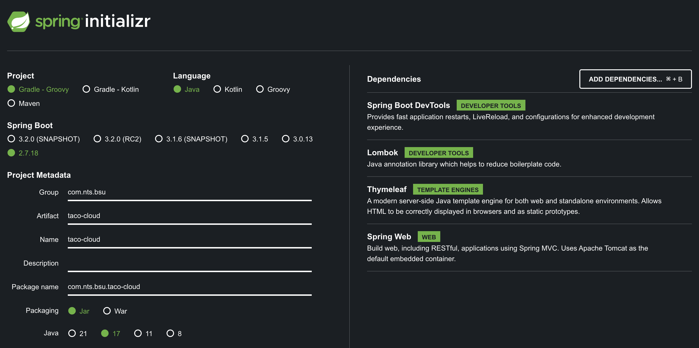

**TOC**
- [스프링이란?](#스프링이란)
  - [스프링 애플리케이션 컨텍스트](#스프링-애플리케이션-컨텍스트)
  - [자동 구성(Auto Configuration), 컴포넌트 스캔(Component Scan)](#자동-구성auto-configuration-컴포넌트-스캔component-scan)
- [스프링 애플리케이션 초기 설정하기](#스프링-애플리케이션-초기-설정하기)
  - [스프링 프로젝트 구조 살펴보기](#스프링-프로젝트-구조-살펴보기)
    - [빌드 도구 Maven, Gradle](#빌드-도구-maven-gradle)
    - [애플리케이션의 부트스트랩(구동)](#애플리케이션의-부트스트랩구동)
    - [애플리케이션 테스트](#애플리케이션-테스트)
- [스프링 애플리케이션 작성하기](#스프링-애플리케이션-작성하기)
  - [웹 요청 처리하기](#웹-요청-처리하기)
    - [Thymeleaf를 사용하는 이유?](#thymeleaf를-사용하는-이유)
  - [뷰 정의하기](#뷰-정의하기)
  - [컨트롤러 테스트하기](#컨트롤러-테스트하기)
  - [애플리케이션 빌드하고 실행하기](#애플리케이션-빌드하고-실행하기)
  - [스프링 부트 DevTools 알아보기](#스프링-부트-devtools-알아보기)
    - [코드 변경 시, 자동으로 애플리케이션을 다시 시작](#코드-변경-시-자동으로-애플리케이션을-다시-시작)
    - [브라우저로 전송되는 리소스 변경 시, 자동으로 브라우저 새로고침하고, 템플릿 캐시를 자동으로 비활성화](#브라우저로-전송되는-리소스-변경-시-자동으로-브라우저-새로고침하고-템플릿-캐시를-자동으로-비활성화)
- [스프링 살펴보기](#스프링-살펴보기)
  - [핵심 스프링 프레임워크](#핵심-스프링-프레임워크)
  - [스프링 부트](#스프링-부트)
  - [스프링 데이터](#스프링-데이터)
  - [스프링 시큐리티](#스프링-시큐리티)
  - [스프링 통합과 배치](#스프링-통합과-배치)
  - [스프링 클라우드](#스프링-클라우드)

---

# 스프링이란?
## 스프링 애플리케이션 컨텍스트
**스프링 애플리케이션 컨텍스트**라는 **컨테이너**를 제공하고, 이를 통해 애플리케이션 컴포넌트(**빈**)들을 생성하고 관리한다.
- 그리고 이러한 빈들은 **의존성 주입**이라는 패턴을 기반으로 상호 연결된다.
- 의존성 주입 또한 컨테이너가 담당한다.

**즉, 스프링 애플리케이션 컨텍스트가 빈들의 생성, 관리 및 서로간의 상호 연결(의존성 주입)까지 모두 수행해준다.**

> [**애플리케이션 컨텍스트?**](https://mangkyu.tistory.com/151)

> **Configuration** vs. **Component**
> - 둘다 @Bean이 적용된 클래스를 빈으로 등록한다는 점은 같지만, Component를 사용했을 때는 다음과 같은 주의점이 있다.
> - 등록할 빈 메소드를 호출하는 구조가 되면, 실제로는 새 인스턴스를 만드는 꼴이 된다.
> - [Proxy Bean, Lite Mode Bean](https://jhkimmm.tistory.com/18)

## 자동 구성(Auto Configuration), 컴포넌트 스캔(Component Scan)
스프링은 자동 구성과 컴포넌트 스캔을 사용해서,
- 자동으로 애플리케이션의 클래스패스에 지정된 컴포넌트를 찾고, 이를 컨테이너의 빈으로 생성
- 이들에 대한 의존성 주입을 수행한다.

> `@EnableAutoConfiguration`
> - 위에서 말한 자동 구성 기능을 사용하겠다. 라는 설정 어노테이션
> - 그리고 해당 어노테이션은 ... 우리가 자주 보는 `@SpringBootApplication` 에 다음과 같이 존재한다.
> ```java
> @SpringBootConfiguration
> @EnableAutoConfiguration
> @ComponentScan(excludeFilters = { @Filter(type = FilterType.CUSTOM, classes = TypeExcludeFilter.class),
> @Filter(type = FilterType.CUSTOM, classes = AutoConfigurationExcludeFilter.class) })
> public @interface SpringBootApplication { ... }
> ```

# 스프링 애플리케이션 초기 설정하기

- [JDK 17](https://adoptium.net/temurin/releases/?version=17)
- [인텔리제이 JDK 변경](https://binux.tistory.com/92)

## 스프링 프로젝트 구조 살펴보기
### 빌드 도구 Maven, Gradle
**Maven**
- Maven 이전의 Ant의 불편함을 해소
- 정형화된 XML 구조 사용

**Gradle**
- XML 문법이 아닌 Groovy 문법 사용
- 더 좋은 가독성
- 최대 100배 빠른 속도.
- [비교](https://gradle.org/maven-vs-gradle/)

### 애플리케이션의 부트스트랩(구동)
**@SpringBootApplication**
- 이 코드가 스프링 부트 애플리케이션임을 나타냄.
- 추가적으로 아래 3개의 어노테이션이 결합된 형태.
  - `@SpringBootConfiguration`: 현재 클래스를 구성 클래스로 지정
  - `@EnableAutoConfiguration`: 위에서 언급한 자동 구성 기능 활성화
  - `@ComponentScan`: 컴포넌트 스캔 활성화

### 애플리케이션 테스트
**@SpringBootTest**
- 스프링 부트 기능으로 테스트를 시작하라는 것을 JUnit에 알려주는 어노테이션.
- 실제 애플리케이션을 로컬에 올려서, 포트 주소를 할당받고, 실제 DB와 Connection까지 진행.

# 스프링 애플리케이션 작성하기
**작성할 것들**
- 홈페이지의 웹 요청을 처리하는 컨트롤러
- 홈페이지의 모습을 정의하는 뷰 템플릿

## 웹 요청 처리하기
스프링의 강력한 웹 프레임워크: **스프링 MVC**
- Model: 클라이언트에게 응답으로 돌려주는 작업의 처리 결과 데이터
- View: Model을 이용해 웹 브라우저와 같은 애플리케이션의 화면에 보이는 리소스(Resource)를 제공하는 역할
- Controller: 클라이언트 측의 요청을 직접적으로 전달받는 엔드포인트(Endpoint)로써 Model과 View의 중간에서 상호작용을 해주는 역할

> 서로에게 영향을 주지 않으면서 개발과 유지보수가 가능하도록 한다.

스프링 MVC의 중심: **Controller**
- 선택적으로 모델 데이터를 채워 응답
- 브라우저에 반환되는 HTML 생성을 위해 해당 응답의 웹 요청을 뷰에 전달

```java
@Controller
public class HomeController {

    @GetMapping
    public String homne() {
        return "home";
    }
}
```
- `home` 값을 갖는 String을 반환한다.
  - 이는 반환할 뷰의 논리적인 이름인데, 현재는 Thymeleaf를 사용해서 뷰 템플릿을 정의하도록 한다.

**논리적인 이름?**
- **home** -> `/templates/` + **home** + `.html` => `/templates/home.html`
- 당연히 해당 경로에 파일이 있어야 한다. 현재는 해당 요청을 보내면 아래 에러가 발생한다.
  - `TemplateInputException: Error resolving template [home], template might not exist or might not be accessible by any of the configured Template Resolvers`

### Thymeleaf를 사용하는 이유?
**특징**
- 서버 사이드 HTML 렌더링(SSR): 백엔드 서버에서 HTML을 동적으로 렌더링하는 용도로 사용된다. 
  - 사용법은 SSR이 다 비슷하기에 학습하기에도 어렵지 않고, 페이지가 어느정도 정적이고 빠른 생산성이 필요한 경우 백엔드 개발자가 개발해야하는 일이 생기는데 이 경우 타임리프는 좋은 선택지이다. 
- 네츄럴 템플릿: 순수한 HTML을 최대한 유지하려는 특징이 있다. 이게 JSP와의 큰 차이점으로 타임리프로 작성한 파일은 확장자도 .HTML이고 웹 브라우저에서 직접 파일을 열어도 내용을 확인할 수 있다. 
  - 물론, 이 경우 동적인 결과 렌더링은 되지 않지만 HTML 마크업 언어가 어떻게 되는지 확인할 수 있다. 
- 스프링 통합 지원: 스프링과 자연스럽게 통합되어 스프링의 다양한 기능을 쉽게 사용할 수 있다. 
- [참고](https://catsbi.oopy.io/32a9458e-f452-4733-b87c-caba75f98e2d)

## 뷰 정의하기
```html
<!-- /templates/home.html -->
<!DOCTYPE html>
<html xmlns="http://www.w3.org/1999/xhtml"
      xmlns:th="http://www.thymeleaf.org">
<head>
    <meta charset="UTF-8">
    <title>Taco Cloud</title>
</head>
<body>
    <h1>Welcome to ...</h1>
    
</body>
</html>
```
- img 태그에서, `@{}` 표현식을 사용해서 타임리프의 `th:src` 속성을 지정한다.
  - `/src/main/resources/static/images` 폴더에 이미지를 위치시키자.

## 컨트롤러 테스트하기
스프링은 웹 애플리케이션을 쉽게 테스트하는 강력한 테스트 지원 기능을 제공한다.

```java
@WebMvcTest(HomeController.class)
public class HomeControllerTest {

    @Autowired
    private MockMvc mockMvc;

    @Test
    public void testHomePage() throws Exception {
        mockMvc.perform(get("/")) // "/"로 GET 요청
                .andExpect(status().isOk()) // 응답 상태는 200
                .andExpect(view().name("home")) // 뷰 이름은 home
                .andExpect(content().string(containsString("Welcome to ..."))); // content에는 "Welcome to ..."가 포함
    }
}
```
- `@WebMvcTest`: 스프링 부트에서 제공하는 테스트 어노테이션, 스프링 MVC 애플리케이션의 형태로 테스트가 실행되도록 한다.
  - 해당 어노테이션은, 스프링의 자동 구성(AutoConfiguration) 기능을 사용하지 않고, Presentation Layer 관련 빈만 스캔해서 등록한다.
  - 추가적으로 필요한 빈에 대해서는 `@MockBean` 어노테이션을 통해 등록할 수 있다.
  - 전체 빈을 등록하지 않아, `@SpringBootTest` 보다 테스트 구동 시간이 짧다.
- [`MockMvc`](https://docs.spring.io/spring-framework/reference/testing/spring-mvc-test-framework.html): 실제 서버 대신, 모의 요청과 응답을 사용해 Spring MVC에 대한 테스트를 지원하는 프레임워크

## 애플리케이션 빌드하고 실행하기
프로젝트 실행 후, `localhost:8080`로 접속해 확인

**Tomcat started on port(s): 8080 (http) with context path ''**
- 톰캣에 대한 설정을 하지 않음에도 위와 같은 로그가 뜨는 이유는, 스프링 부트 애플리케이션이 실행에 필요한 모든 것을 포함하는데, 여기에 톰캣이 포함되기 때문이다.
  - 즉, 애플리케이션 내부에 이미 톰캣이 존재한다.

## 스프링 부트 DevTools 알아보기
### 코드 변경 시, 자동으로 애플리케이션을 다시 시작
이는 변경을 감시하면서, 프로젝트의 자바 코드와 속성 파일들이 변경되면, 곧바로 애플리케이션을 다시 시작시켜, 해당 변경을 적용시킨다.

DevTools를 사용하는 애플리케이션은 JVM에서 2개의 클래스 로더에 의해 로드된다.
- src/main 경로에 있는 모든 파일 -> 자주 변경될 수 있는 것들과 함께 로드
- 자주 변경되지 않는 의존성 라이브러리와 함께 로드

=> 변경 감지 시, 자주 변경될 수 있는 것들만 로드한 클래스 로더만 다시 로드해서, 스프링 애플리케이션 컨텍스트를 다시 시작시킨다.
- 의존성 변경과 같은 경우는 어쩔 수 없이 애플리케이션을 수동으로 다시 시작시켜야 한다.

### 브라우저로 전송되는 리소스 변경 시, 자동으로 브라우저 새로고침하고, 템플릿 캐시를 자동으로 비활성화
Thymeleaf, FreeMarker와 같은 템플릿에서는 템플릿의 파싱 결과를 기본적으로 캐싱한다.
- 이는 성능상의 이점을 위함으로, 실제 운영 환경에서 유용하다.

하지만 개발 환경에서는 이러한 특성이 유용하지 않을 수 있다.
- 따라서 DevTools는 모든 템플릿 캐싱을 비활성화함으로써, 이 문제를 해결.
- 브라우저만 새로고침하면 변경된 템플릿이 적용.

브라우저 새로고침까지 귀찮을 개발자를 위해, LiveReload 서버 또한 활성화한다.
- 이는 LiveReload 브라우저 플러그인과 함께 사용될 때 더 유용하다.

# 스프링 살펴보기
## 핵심 스프링 프레임워크
**스프링 MVC**
- 앞서 다룬 HTML을 다루는 방법 외에, REST API를 다루는 때에도 이를 사용할 수 있다.

**템플릿 기반의 JDBC 지원(JdbcTemplate)**
- 위 기능을 포함한 기본적인 데이터 persistence 지원 제공

**리액티브 프로그래밍**
- Spring MVC 개념의 스프링 WebFlux라는 새로운 리액티브 웹 프레임워크를 포함한다.

## 스프링 부트
: 스프링으로 애플리케이션을 만들 때에 필요한 설정을 간편하게 처리해주는 별도의 프레임워크
스타터 의존성, 자동-구성 외에도 스프링 부트가 제공하는 편의 기능
- Actuactor: 애플리케이션의 내부 작동에 대한 정보 제공
- 환경 속성 명세
- 테스트 지원

## 스프링 데이터
핵심 스프링 프레임워크에 포함된 기본적인 데이터 persistence 외에 추가적인 기능 제공.
- 간단한 자바 인터페이스로 애플리케이션의 데이터 repository 정의 가능.
- 여러 DB와 함께 사용가능. 그래서 여러 Spring Data 모듈 존재

> 이를 통해 개발자는 DB에 접근하는 로직을 비즈니스 로직과 분리시킬 수 있다.

## 스프링 시큐리티
스프링의 강력한 보안 프레임워크
- 인증, 허가, API 보안을 포함하는 범위의 애플리케이션의 보안 요구사항을 다룬다.
- ex. 사용자 로그인 처리 및 유지, API 접근 권한 구분 등...

## 스프링 통합과 배치
- 스프링 통합(Integration): 사용 가능한 즉시 처리되는 실시간 통합을 수행
  - [참고](https://seriouskang.tistory.com/1)
- 스프링 배치: 대량의 데이터가 처리되는 시점을 트리거가 알려줄 때, 데이터가 수집 처리되는 배치 통합을 처리
  - [참고](https://godekdls.github.io/Spring%20Batch/contents/)
  - [향로](https://github.com/jojoldu/spring-batch-in-action)

## 스프링 클라우드
마이크로 서비스라는 여러 개의 개별적인 단위들로 합성한 애플리케이션이 등장하게 된다.
- 스프링 클라우드: 스프링을 사용해, 클라우드 애플리케이션을 개발하기 위한 프로젝트들의 모음